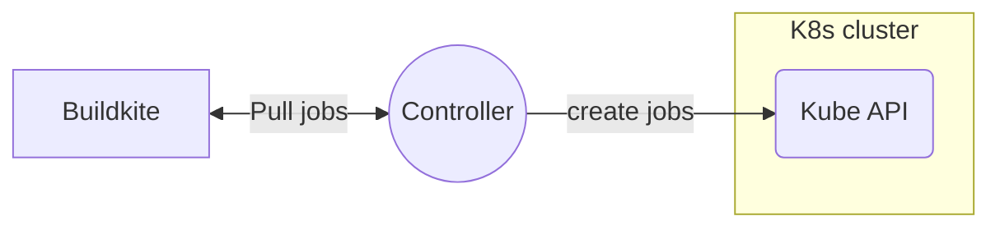

# The development guide for the Buildkite Agent Stack for Kubernetes controller

This guide covers everything you need to know to contribute to and develop the Buildkite Agent Stack for Kubernetes controller codebase.

Note that our development approach emphasizes testability, reliability, and maintainability.
Contributors should focus on writing clean, well-tested code that follows established Go patterns and practices.

When contributing:

- Create feature branches from `main`.
- Add appropriate tests for new functionality.
- Ensure all tests pass locally before submitting pull requests.
- Follow [Go code style](https://google.github.io/styleguide/go/) conventions.
- Include detailed commit messages explaining changes.

The integration test suite is crucial to our development workflow - it verifies that changes maintain compatibility with both Buildkite and Kubernetes APIs.

## Local dependencies

To start developing for the Buildkite Agent Stack for Kubernetes controller, you'll need to install dependencies with Homebrew via:

```bash
brew bundle
```

Run tasks via [just](https://github.com/casey/just):

```bash
just --list
```

## Integration tests

The Buildkite Agent Stack for Kubernetes controller integration tests depend on a running Buildkite instance. By default, they use the production version of Buildkite.



During a test run, each integration test generally performs these steps:

1. Create ephemeral pipelines and queues for a given [Buildkite Agent Cluster](https://buildkite.com/docs/clusters/overview).
2. Runs the controller, which will monitor jobs from the (just-created) queue in the Buildkite Cluster and start new Jobs in the Kubernetes cluster.
3. Starts a build of the pipeline on Buildkite, which causes Buildkite jobs to become available.
4. Polls Buildkite while waiting for the expected outcome, which may include build success, build failure, and the presence or absence of certain log messages.
5. Cleans up those ephemeral objects (pipelines and queues).

### Local setup

Any Buildkite user who has an access to a Kubernetes cluster should be able to run our integration test.

To get the integration test running locally, you will need:

1. A valid Buildkite API token with GraphQL enabled. (This is only used by integration test)
2. A valid Buildkite Agent Token in your target Buildkite Cluster.
3. Depending on test cases, you may also need SSH keys - see below.
4. Your shell environment will need CLI write access to a Kubernetes cluster such as the one provided by https://orbstack.dev/.

It's generally convenient to supply the API token as an environment variable. This can be done using an `.envrc` file loaded by using [direnv](https://direnv.net/).

```bash
export BUILDKITE_TOKEN="bkua_**************"
```

Then check your k8s permissions by running:

```bash
just check-k8s-api-access
```

Lastly provide the agent token, the Buildkite Agent token is used by the controller and by the kubernetes jobs:

```bash
kubectl create secret generic buildkite-agent-token --from-literal=BUILDKITE_AGENT_TOKEN=$YOUR_CLUSTER_AGENT_TOKEN
```

### Running integration tests locally

To run integration test locally, we recommend you to run individual tests via `-run`. For example,

```bash
just test -v -run TestWalkingSkeleton
```

The `-v` will ensure log being visible.

To run all integration tests, with the overrides from your environment, you can use the following command:

```bash
just test -v ./internal/integration/... -args --buildkite-token $BUILDKITE_TOKEN
```

NOTE: various integration tests have special requirements, such as needing extra secrets like SSH key etc.
To avoid unnecessary complexity, we recommend you to run individual tests on demand locally.


## Running locally

To run the controller locally, you need to follow the Local setup guide in the integration guide above.

And then run the following example.

```bash
just run
```

Or if you want the local controller to poll jobs from a partituclar queue.

```bash
just run --tags 'queue=some-queue'
```

## Unit test locally

Running all the unit tests locally is done as follows:

```bash
go test -v -cover `go list ./... | grep -v internal/integration`
```

## Token scopes

Required Buildkite API token scopes:

- `read_clusters`
- `read_artifacts`
- `read_builds`
- `read_build_logs`
- `write_pipelines`
- `write_clusters`

## SSH secret

You'll need to create an SSH secret in your cluster to run [this test pipeline](internal/integration/fixtures/secretref.yaml). This SSH key needs to be associated with your GitHub account to be able to clone this public repo, and must be in a form acceptable to OpenSSH (aka `BEGIN OPENSSH PRIVATE KEY`, not `BEGIN PRIVATE KEY`).

```bash
kubectl create secret generic integration-test-ssh-key --from-file=SSH_PRIVATE_RSA_KEY=$HOME/.ssh/id_github
```

## Debugging

The integration tests on the [`kubernetes-agent-stack`](https://buildkite.com/buildkite-kubernetes-stack/kubernetes-agent-stack) pipeline will create additional pipelines in the [`buildkite-kubernetes-stack`](https://buildkite.com/buildkite-kubernetes-stack) organization.

### If the Buildkite agent is unable to connect

If the Buildkite agent token is allowing jobs to be picked up, and each job
continuously fails with a HTTP 422 error, the most likely cause here is that the stored agent token is invalid.
To confirm this, validate that the token value is indeed provided as expected:

```bash
kubectl get secret buildkite-agent-token -o jsonpath='{.data.BUILDKITE_AGENT_TOKEN}' \
    | base64 -d \
    | xxd
```

Different shells behave differently so if a newline is being added to the value before it is being
encoded, using the following could be helpful:

```bash
echo -n ${BUILDKITE_AGENT_TOKEN} | base64
kubectl edit secret buildkite-agent-token
```

The `edit secret` command will open `$EDITOR` with the spec of the secret. The output from the
previous command can be copied into the spec as the new value for the secret.

### Cleanup

In general, for successful tests, pipelines will be deleted automatically. However, for unsuccessful tests, they will remain after the end of the test job to allow you to debug them.

To clean them up, run:

```bash
just cleanup-orphans
```

For this to work, you will need a Buildkite API token with GraphQL enabled and the following REST API scopes also enabled:

- `read_artifacts`
- `write_pipelines`

This is usually enough, but there is another situation where the cluster could be clogged with Kubernetes jobs.
To clean these out, you should run the following in a Kubernetes context in the namespace containing the controller used to run the CI pipeline.

```bash
kubectl get -o jsonpath='{.items[*].metadata.name}' jobs | xargs -L1 kubectl delete job
```

## CI ❤️  integration test

At the time of writing, the CI pipeline run in an EKS cluster, `agent-stack-k8s-ci` in the `buildkite-dist` AWS account.
CI deploys the controller onto `buildkite` namespace in that cluster.

## Local deployment with Helm

`just deploy` will build the container image using [ko](https://ko.build/) and
deploy it with [Helm](https://helm.sh/).

You'll need to have set `KO_DOCKER_REPO` to a repository you have push access
to. For development, something like the [kind local
registry](https://kind.sigs.k8s.io/docs/user/local-registry/) or the [minikube
registry](https://minikube.sigs.k8s.io/docs/handbook/registry) can be used. More
information is available at [ko's
website](https://ko.build/configuration/#local-publishing-options).

You'll also need to provide the required configuration values to Helm, which can be done by passing extra args to `just`:

```bash
just deploy --values config.yaml
```

With config.yaml being a file containing [required Helm values](values.yaml), such as:

```yaml
agentToken: "abcdef"
graphqlToken: "12345"
```

The `config` key contains configuration passed directly to the binary, and so supports all the keys documented in [the example](examples/config.yaml).

## Release procedure

1. Make sure you're on the main branch!
1. Create a tag

    ```bash
    git tag -sm v0.x.x v0.x.x
    ```

1. Push your tag

    ```bash
    git push --tags
    ```

1. A build will start at https://buildkite.com/buildkite-kubernetes-stack/kubernetes-agent-stack/builds?branch=v0.x.x. It will create a draft release with a changelog. Edit the changelog to group the PRs in to sections like

    ```markdown
    # Added
    # Fixed
    # Changed
    # Security
    # Internal
    ```

1. Publish the release 🎉
