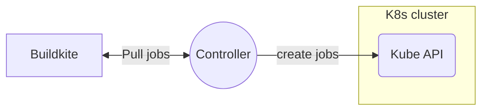

Agent Stack K8s Development
===

# Local Dependencies
Install dependencies with Homebrew via:

```bash
brew bundle
```

Run tasks via [just](https://github.com/casey/just):

```bash
just --list
```

# Integration Tests

## Architecture

Agent Stack K8s integration tests depend on a running Buildkite instance. By default, they use the production Buildkite.



During test run, the test suites:
1. create ephemeral pipelines and queues for a given [Buildkite Agent Cluster](https://buildkite.com/docs/clusters/overview).
2. Run executor, which will monitor jobs from the target queue in target Buildkite Cluster,
   starts new Jobs in a Kubernetes cluster.
3. Test suite will clean up those ephemeral objects in the end.

To run integration test locally, we recommend you to run individual test. For example,

```bash
just test -run TestWalkingSkeleton
```

## Setup

Any member of the public should be able to run our integration as long as you are an user of Buildkite, and you have
access to a Kubernetes cluster.

Concretely, to get the integration test running locally, you will need:
1. A valid Buildkite API token (presuming you are a customer of Buildkite).
2. A valid Buildkite Agent Token in your target Buildkite Cluster. The agent token needs to be installed in your K8s
   cluster.
3. Your organization name in Buildkite and your target Buildkite Cluster UUID.
4. Depending on test cases, you may also need a SSH keys, please read below.
5. Your shell environment will need CLI write access to a k8s cluster such as the one provided by https://orbstack.dev/.

### Use environment variables

We found it's convenient to supply API token, organization name, and cluster UUID as environment variables. This can be done using an `.envrc` file loaded by using [direnv](https://direnv.net/).

```bash
export BUILDKITE_TOKEN="bkua_**************"
export ORG="your-cool-org-slug"
export CLUSTER_UUID="UUID-UUID-UUID-UUID"
```

# Running Locally

To run the controller locally, with the environment variables, note in this example I am overriding the queue to ensure jobs from the default queue which is "", are picked up by this agent.

```
just run --org $ORG --buildkite-token $BUILDKITE_TOKEN --debug --tags 'queue=,os=linux'
```

# Testing Locally

Before you start, check which kubernetes cluster configuration your using by default.

```
kubectl config current-context
```

To see the entire configuration.

```
kubectl config view
```

Running all the unit tests locally is done as follows:

```
go test -v -cover `go list ./... | grep -v internal/integration`
```

To run the integration tests, with the overrides from your environment, you can use the following command:

```
just test -timeout 10m -v ./internal/integration/... -args --org $ORG --buildkite-token $BUILDKITE_TOKEN
```

To run a single test, following goes `-run` convention will provide this capability:

```
just test -timeout 10m -v ./internal/integration/... -run TestImagePullBackOffFailed -args --org $ORG --buildkite-token $BUILDKITE_TOKEN
```

### Token Scopes

Required Buildkite API token scopes:

- `read_artifacts`
- `read_build_logs`
- `write_pipelines`
- `write_clusters`

### Install Agent Token

Agent token is used by the k8s jobs instead of controller, so:

```bash
kubectl create secret generic buildkite-agent-token --from-literal=BUILDKITE_AGENT_TOKEN=my-agent-token
```

### SSH secret

You'll also need to create an SSH secret in your cluster to run [this test pipeline](internal/integration/fixtures/secretref.yaml). This SSH key needs to be associated with your GitHub account to be able to clone this public repo, and must be in a form acceptable to OpenSSH (aka `BEGIN OPENSSH PRIVATE KEY`, not `BEGIN PRIVATE KEY`).

```bash
kubectl create secret generic integration-test-ssh-key --from-file=SSH_PRIVATE_RSA_KEY=$HOME/.ssh/id_github
```

## Debugging

The integration tests on the [`kubernetes-agent-stack`](https://buildkite.com/buildkite-kubernetes-stack/kubernetes-agent-stack) pipeline will create additional pipelines in the [`buildkite-kubernetes-stack`](https://buildkite.com/buildkite-kubernetes-stack) organization.

### Agent unable to connect

In circumstances where the Buildkite token is allowing jobs to be picked up, and each job
continuously fails with a HTTP 422 error, this is likely the stored agent token being invalid.
Validate that the token is indeed the value as expected:

```bash
kubectl get secret buildkite-agent-token -o jsonpath='{.data.BUILDKITE_AGENT_TOKEN}' \
    | base64 -d \
    | xxd
```

Different shells behave differently, if a newline is being added to the value before it is being
encoded, using the following could be helpful:

```bash
echo -n ${BUILDKITE_AGENT_TOKEN} | base64
kubectl edit secret buildkite-agent-token
```

The `edit secret` command will open `$EDITOR` with the spec of the secret. The output from the
previous command can be copied into the spec as the new value for the secret.

## Cleanup

In general, pipelines will be deleted automatically for successful tests, but for unsuccessful tests, then will remain after then end of the test job to allow you to debug them.

To do clean them up:

```bash
just cleanup-orphans
```

The token will need to have GraphQL access as well as:

- `read_artifacts`
- `write_pipelines`

This is usually enough, but there is another situation where the cluster could be clogged with K8s jobs.
To clean these out you should run the following in a kubernetes context in the namespace containing the controller used to run the CI pipeline.

```bash
kubectl get -o jsonpath='{.items[*].metadata.name}' jobs | xargs -L1 kubectl delete job
```

## CI ❤️  Integration Test

At the time of writing, the CI pipeline run in an EKS cluster, `agent-stack-k8s-ci` in the `buildkite-agent` AWS account.
CI deployes the controller onto `buildkite` namespace in that cluster.

# Run from source

Running from the source can be useful for debugging purpose, you will generally need to meet the same requirement of
running a integration test.

In this case, you can choose to supply some inputs via CLI parameters instead of environment variable.

```bash
just run --org my-org --buildkite-token my-api-token --debug --cluster-uuid my-cluster-uuid
```

## Local Deployment with Helm

`just deploy` will build the container image using [ko](https://ko.build/) and
deploy it with [Helm](https://helm.sh/).

You'll need to have set `KO_DOCKER_REPO` to a repository you have push access
to. For development something like the [kind local
registry](https://kind.sigs.k8s.io/docs/user/local-registry/) or the [minikube
registry](https://minikube.sigs.k8s.io/docs/handbook/registry) can be used. More
information is available at [ko's
website](https://ko.build/configuration/#local-publishing-options).

You'll also need to provide required configuration values to Helm, which can be done by passing extra args to `just`:

```bash
just deploy --values config.yaml
```

With config.yaml being a file containing [required Helm values](values.yaml), such as:

```yaml
agentToken: "abcdef"
graphqlToken: "12345"
config:
  org: "my-buildkite-org"
```

The `config` key contains configuration passed directly to the binary, and so supports all the keys documented in [the example](examples/config.yaml).

# Release

1. Make sure you're on the main branch!
1. Create a tag

    ```bash
    git tag -sm v0.x.x v0.x.x
    ```

1. Push your tag

    ```bash
    git push --tags
    ```

1. A build will start at https://buildkite.com/buildkite-kubernetes-stack/kubernetes-agent-stack/builds?branch=v0.x.x. It will create a draft release with a changelog. Edit the changelog to group the PRs in to sections like

    ```markdown
    # Added
    # Fixed
    # Changed
    # Security
    # Internal
    ```

1. Publish the release 🎉
