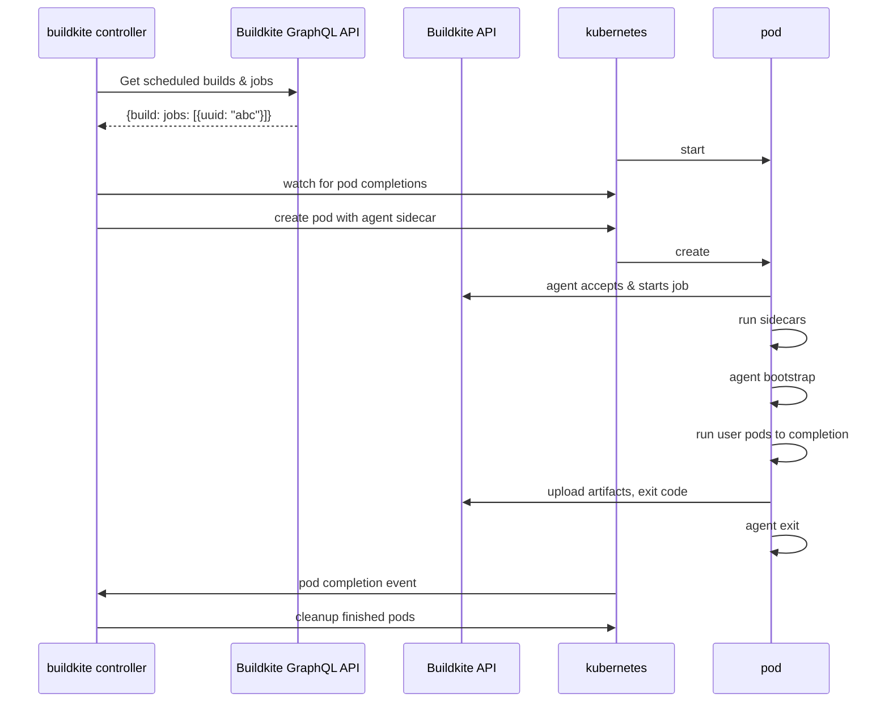

# Buildkite Agent Stack for Kubernetes

[](https://buildkite.com/buildkite-kubernetes-stack/kubernetes-agent-stack)

## Overview

A Kubernetes controller that runs [Buildkite steps](https://buildkite.com/docs/pipelines/defining-steps) as [Kubernetes jobs](https://kubernetes.io/docs/concepts/workloads/controllers/job/).

## Installation

### Requirements

- A Kubernetes cluster
- An API token with the [GraphQL scope enabled](https://buildkite.com/docs/apis/graphql-api#authentication)
- An [agent token](https://buildkite.com/docs/agent/v3/tokens)

### Deploy with Helm

The simplest way to get up and running is by deploying our [Helm](https://helm.sh) chart:

```bash
helm upgrade --install agent-stack-k8s oci://ghcr.io/buildkite/helm/agent-stack-k8s \
    --create-namespace \
    --namespace buildkite \
    --set config.org=<your Buildkite org slug> \
    --set agentToken=<your Buildkite agent token> \
    --set graphqlToken=<your Buildkite GraphQL-enabled API token>
```

We're using Helm's support for [OCI-based registries](https://helm.sh/docs/topics/registries/),
which means you'll need Helm version 3.8.0 or newer.

You can also use this chart as a dependency:

```yaml
dependencies:
- name: agent-stack-k8s
  version: "0.5.0"
  repository: "oci://ghcr.io/buildkite/helm"
```

or use it as a template:

```
helm template oci://ghcr.io/buildkite/helm/agent-stack-k8s -f my-values.yaml
```

Available versions and their digests can be found on [the releases page](https://github.com/buildkite/agent-stack-k8s/releases).

### Options

```text
$ agent-stack-k8s --help
Usage of agent-stack-k8s:
      --agent-token-secret string   name of the Buildkite agent token secret (default "buildkite-agent-token")
      --buildkite-token string      Buildkite API token with GraphQL scopes
  -f, --config string               config file path
      --debug                       debug logs
      --image string                The image to use for the Buildkite agent (default "ghcr.io/buildkite/agent-k8s:latest")
      --job-ttl duration            time to retain kubernetes jobs after completion (default 10m0s)
      --max-in-flight int           max jobs in flight, 0 means no max (default 1)
      --namespace string            kubernetes namespace to create resources in (default "default")
      --org string                  Buildkite organization name to watch
      --tags strings                A comma-separated list of tags for the agent (for example, "linux" or "mac,xcode=8") (default [queue=kubernetes])
```

Configuration can also be provided by a config file (`--config` or `CONFIG`), or environment variables. In the [examples](examples) folder there is a sample [YAML config](examples/config.yaml) and a sample [dotenv config](examples/config.env).

### Sample buildkite pipeline

```yaml
steps:
  - label: build image
    agents:
      queue: kubernetes
    plugins:
      - kubernetes:
          podSpec:
            containers:
              - image: alpine:latest
                command: [echo]
                args:
                - "Hello, world!"
```

The `podSpec` of the `kubernetes` plugin can support any field from the `PodSpec` resource [in the Kubernetes API documentation](https://kubernetes.io/docs/reference/generated/kubernetes-api/v1.24/#podspec-v1-core).

More samples can be found in the [integration test fixtures directory](internal/integration/fixtures).

### Sidecars

Sidecar containers can be added to your job by specifying them under the top-level `sidecars` key. See [this example](internal/integration/fixtures/sidecars.yaml) for a simple job that runs `nginx` as a sidecar, and accesses the nginx server from the main job.

There is no guarantee that your sidecars will have started before your job, so using retries or a tool like [wait-for-it](https://github.com/vishnubob/wait-for-it) is a good idea to avoid flaky tests.

### Validating your pipeline

With the unstructured nature of Buildkite plugin specs, it can be frustratingly
easy to mess up your configuration and then have to debug why your agent pods are failing to start.
To help prevent this sort of error, there's a linter that uses [JSON
schema](https://json-schema.org/) to validate the pipeline and plugin
configuration.

This currently can't prevent every sort of error, you might still have a reference to a Kubernetes volume that doesn't exist, or other errors of that sort, but it will validate that the fields match the API spec we expect.

Our JSON schema can also be used with editors that support JSON Schema by configuring your editor to validate against the schema found [here](./cmd/linter/schema.json).

### Cloning repos via SSH

To use SSH to clone your repos, you'll need to add a secret reference via an [EnvFrom](https://kubernetes.io/docs/reference/generated/kubernetes-api/v1.25/#envfromsource-v1-core) to your pipeline to specify where to mount your SSH private key from.

```yaml
steps:
  - label: build image
    agents:
      queue: kubernetes
    plugins:
      - kubernetes:
          gitEnvFrom:
            - secretRef: { name: agent-stack-k8s } # <--
          podSpec:
            containers:
              - image: gradle:latest
                command: [gradle]
                args:
                  - jib
                  - --image=ttl.sh/example:1h
```

The agent will automatically configure SSH access based on environment variables using the [docker-ssh-env-config](https://github.com/buildkite/docker-ssh-env-config) shell script. This script will run during the `checkout` stage of the job, and all resulting SSH keys and SSH config will live in the `/workspace/.ssh` in subsequent containers of the job.

To use these keys and config in a separate step, for example if your job runs `git clone`, you can either:

- symlink the `/workspace/.ssh` directory to `~/.ssh`
- specify the path to the key explicitly, for example by setting `GIT_SSH_COMMAND="ssh -i /workspace/.ssh/id_rsa"` in your job's environment.

Note that setting the `HOME` environment variable in your container will likely not work, since OpenSSH looks for the home directory configured in `/etc/passwd`.

## How does it work

The controller uses the [Buildkite GraphQL API](https://buildkite.com/docs/apis/graphql-api) to watch for scheduled work that uses the `kubernetes` plugin.

When a job is available, the controller will create a pod to acquire and run the job. It converts the [PodSpec](https://kubernetes.io/docs/reference/generated/kubernetes-api/v1.25/#podspec-v1-core) in the `kubernetes` plugin into a pod by:

- adding an init container to:
  - copy the agent binary onto the workspace volume
- adding a container to run the buildkite agent
- adding a container to clone the source repository
- modifying the user-specified containers to:
  - overwrite the entrypoint to the agent binary
  - run with the working directory set to the workspace

The entrypoint rewriting and ordering logic is heavily inspired by [the approach used in Tekton](https://github.com/tektoncd/pipeline/blob/933e4f667c19eaf0a18a19557f434dbabe20d063/docs/developers/README.md#entrypoint-rewriting-and-step-ordering).

## Architecture



## Development

Install dependencies with Homebrew via:

```bash
brew bundle
```

Run tasks via [just](https://github.com/casey/just):

```bash
just --list
```

For running the integration tests you'll need to add some additional scopes to your Buildkite API token:

- `read_artifacts`
- `read_build_logs`
- `write_pipelines`

You'll also need to create an SSH secret in your cluster to run [this test pipeline](internal/integration/fixtures/secretref.yaml). This SSH key needs to be associated with your GitHub account to be able to clone this public repo, and must be in a form acceptable to OpenSSH (aka `BEGIN OPENSSH PRIVATE KEY`, not `BEGIN PRIVATE KEY`).

```bash
kubectl create secret generic agent-stack-k8s --from-file=SSH_PRIVATE_RSA_KEY=$HOME/.ssh/id_github
```

### Run from source

First store the agent token in a Kubernetes secret:

```bash!
kubectl create secret generic buildkite-agent-token --from-literal=BUILDKITE_AGENT_TOKEN=my-agent-token
```

Next start the controller:

```bash!
just run --org my-org --buildkite-token my-api-token --debug
```

### Local Deployment with Helm

`just deploy` will build the container image using [ko](https://ko.build/) and
deploy it with [Helm](https://helm.sh/).

You'll need to have set `KO_DOCKER_REPO` to a repository you have push access
to. For development something like the [kind local
registry](https://kind.sigs.k8s.io/docs/user/local-registry/) or the [minikube
registry](https://minikube.sigs.k8s.io/docs/handbook/registry) can be used. More
information is available at [ko's
website](https://ko.build/configuration/#local-publishing-options).

You'll also need to provide required configuration values to Helm, which can be done by passing extra args to `just`:

```bash
just deploy --values config.yaml
```

With config.yaml being a file containing [required Helm values](values.yaml), such as:

```yaml
agentToken: "abcdef"
graphqlToken: "12345"
config:
  org: "my-buildkite-org"
```

The `config` key contains configuration passed directly to the binary, and so supports all the keys documented in [the example](examples/config.yaml).

## Open questions

- How to deal with stuck jobs? Timeouts?
- How to deal with pod failures (not job failures)?
  - Report failure to buildkite from controller?
  - Emit pod logs to buildkite? If agent isn't starting correctly
  - Retry?
