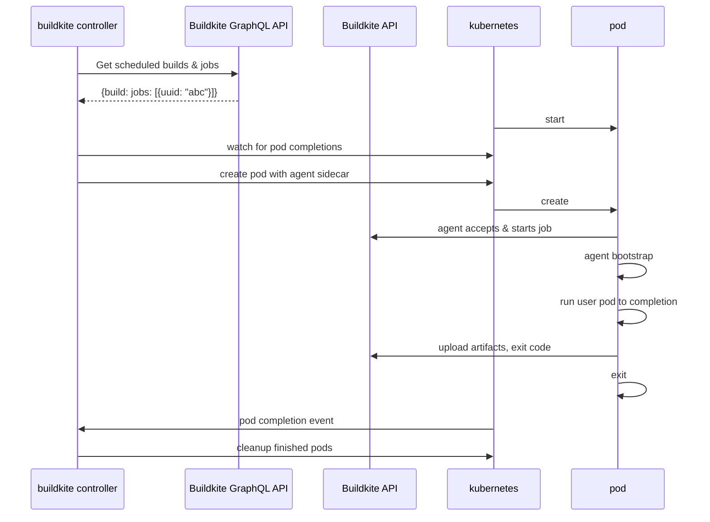

# Buildkite Agent Stack for Kubernetes

## Overview

A Kubernetes controller that runs Buildkite jobs as workloads on Kubernetes.

## Explain it like I'm 5

The controller uses the [Buildkite GraphQL API](https://buildkite.com/docs/apis/graphql-api) to watch for scheduled work that uses the `kubernetes` plugin.

When a job is available, the controller will create a pod to acquire and run the job. It converts the [PodTemplate](https://kubernetes.io/docs/reference/generated/kubernetes-api/v1.25/#podtemplate-v1-core) in the `kubernetes` plugin into a pod by:

- adding an init container to:
  - acquire the job
  - copy the agent binary onto the workspace volume
  - clone the source repository onto the workspace
- modifying the user-specified container to:
  - overwrite the entrypoint to the agent binary
  - run with the working directory set to the workspace

The entrypoint rewriting and ordering logic is heavily inspired by [the approach used in Tekton](https://github.com/tektoncd/pipeline/blob/933e4f667c19eaf0a18a19557f434dbabe20d063/docs/developers/README.md#entrypoint-rewriting-and-step-ordering).

## Usage

```bash!
buildkite-controller --token 123abc
```

Options:

- `--namespace`: Kubernetes namespace to create resources within (default: `buildkite`)
- `--kubeconfig`: specify the path to a kubeconfig (default: `~/.kube/config` / in-cluster configuration)
- `--token`: a Buildkite [API Token](https://buildkite.com/user/api-access-tokens/new) with the GraphQL API scope
- `--agent-image`: The image to use for the Buildkite agent,(default: `buildkite/agent:latest`)

## Architecture



## Sample buildkite pipeline

```yaml!
steps:
- label: build image
  plugins:
  - kubernetes:
      containers:
      - image: gradle:latest
        command: [gradle]
        args:
        - jib
        - --image=ttl.sh/example:1h
```

## Resulting execution pod

```yaml!
apiVersion: v1
kind: Pod
metadata:
  name: agent-abc
spec:
  initContainers:
  - image: buildkite/agent:latest
    args:
    - start
    - --acquire-job=abc
    volumeMounts:
    - mountPath: /workspace
      name: workspace
  containers:
  - image: gradle:latest
    command: "/workspace/agent"
    args:
    - exec
    - --
    - jib
    - --image=ttl.sh/example:1h
    workingDir: /workspace
    volumeMounts:
    - mountPath: /workspace
      name: workspace
  - image: buildkite/agent:latest
    args: [upload-artifacts]
    workingDir: /workspace
    volumeMounts:
    - mountPath: /workspace
      name: workspace
  volumes:
  - name: workspace
    emptyDir: {}
```

## Sidecar

### Responsibilities

- Copies wrapper to shared EmptyDir volume
- Orders execution of containers in pod by using a mutex
- Wraps execution in order to redirect stdout/stderr and upload artifacts

## Open questions

- How to deal with stuck jobs? Timeouts?
- How to deal with pod failures (not job failures)?
  - Report failure to buildkite from controller?
  - Emit pod logs to buildkite? If agent isn't starting correctly
  - Retry?
- How to deal with secrets? SSH, image pull, etc.
  - [Tekton's solution](https://tekton.dev/vault/pipelines-v0.14.3/auth/#guiding-credential-selection) seems decent enough. [This is the code](https://github.com/tektoncd/pipeline/blob/2b54123eaafe5d6b86577402830e0957928374d2/pkg/pod/creds_init.go#L53) grabs secrets and turns them into volume mounts
  - the buildkite agent image comes with [this ssh config wrapper](https://github.com/buildkite/docker-ssh-env-config)
