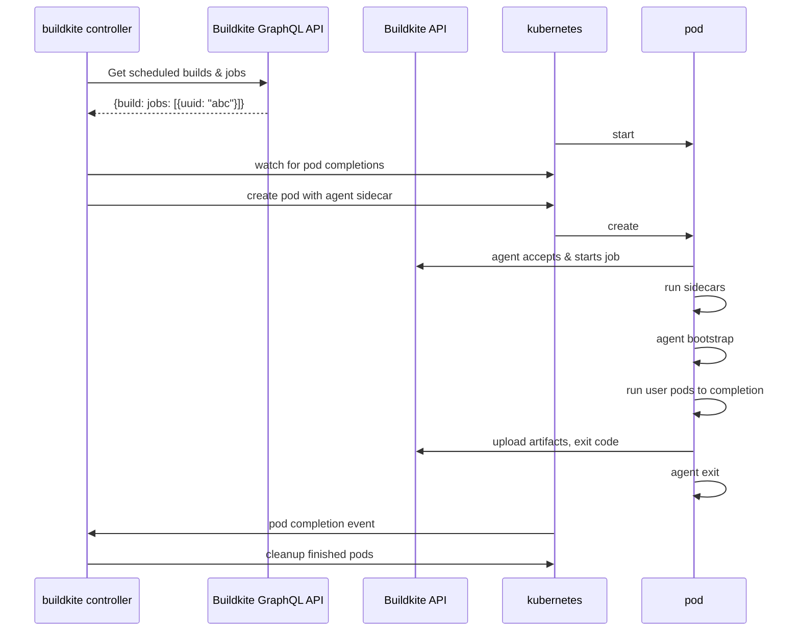

# Buildkite Agent Stack for Kubernetes

[](https://buildkite.com/buildkite-kubernetes-stack/kubernetes-agent-stack)

## Overview

A Kubernetes controller that runs [Buildkite steps](https://buildkite.com/docs/pipelines/defining-steps) as [Kubernetes jobs](https://kubernetes.io/docs/concepts/workloads/controllers/job/).

## Installation

### Requirements

- A Kubernetes cluster
- An API token with the [GraphQL scope enabled](https://buildkite.com/docs/apis/graphql-api#authentication)
- An [agent token](https://buildkite.com/docs/agent/v3/tokens)

### Deploy with Helm

The simplest way to get up and running is by deploying our [Helm](https://helm.sh) chart:

```bash
helm upgrade --install agent-stack-k8s oci://ghcr.io/buildkite/helm/agent-stack-k8s \
    --create-namespace \
    --namespace buildkite \
    --set config.org=<your Buildkite org slug> \
    --set agentToken=<your Buildkite agent token> \
    --set graphqlToken=<your Buildkite GraphQL-enabled API token>
```

We're using Helm's support for [OCI-based registries](https://helm.sh/docs/topics/registries/),
which means you'll need Helm version 3.8.0 or newer.

This will create an agent-stack-k8s installation that will listen to the `kubernetes` queue.
See the `--tags` [option](#Options) for specifying a different queue.

#### Externalize Secrets

You can also have an external provider create a secret for you in the namespace before deploying the chart with helm. If the secret is pre-provisioned, replace the `agentToken` and `graphqlToken` arguments with:

```bash
--set agentStackSecret=<secret-name>
```

The format of the required secret can be found in [this file](./charts/agent-stack-k8s/templates/secrets.yaml.tpl).

#### Other Installation Methods

You can also use this chart as a dependency:

```yaml
dependencies:
- name: agent-stack-k8s
  version: "0.5.0"
  repository: "oci://ghcr.io/buildkite/helm"
```

or use it as a template:

```
helm template oci://ghcr.io/buildkite/helm/agent-stack-k8s -f my-values.yaml
```

Available versions and their digests can be found on [the releases page](https://github.com/buildkite/agent-stack-k8s/releases).

### Options

```text
Usage:
  agent-stack-k8s [flags]
  agent-stack-k8s [command]

Available Commands:
  completion  Generate the autocompletion script for the specified shell
  help        Help about any command
  lint        A tool for linting Buildkite pipelines
  version     Prints the version

Flags:
      --agent-token-secret string   name of the Buildkite agent token secret (default "buildkite-agent-token")
      --buildkite-token string      Buildkite API token with GraphQL scopes
      --cluster-uuid string         UUID of the Buildkite Cluster. The agent token must be for the Buildkite Cluster.
  -f, --config string               config file path
      --debug                       debug logs
  -h, --help                        help for agent-stack-k8s
      --image string                The image to use for the Buildkite agent (default "ghcr.io/buildkite/agent-stack-k8s/agent:latest")
      --job-ttl duration            time to retain kubernetes jobs after completion (default 10m0s)
      --max-in-flight int           max jobs in flight, 0 means no max (default 25)
      --namespace string            kubernetes namespace to create resources in (default "default")
      --org string                  Buildkite organization name to watch
      --profiler-address string     Bind address to expose the pprof profiler (e.g. localhost:6060)
      --tags strings                A comma-separated list of agent tags. The "queue" tag must be unique (e.g. "queue=kubernetes,os=linux") (default [queue=kubernetes])

Use "agent-stack-k8s [command] --help" for more information about a command.
```

Configuration can also be provided by a config file (`--config` or `CONFIG`), or environment variables. In the [examples](examples) folder there is a sample [YAML config](examples/config.yaml) and a sample [dotenv config](examples/config.env).

### Sample Buildkite Pipelines
For simple commands, you merely have to target the queue you configured agent-stack-k8s with.
```yaml
steps:
- label: Hello World!
  command: echo Hello World!
  agents:
    queue: kubernetes
```
For more complicated steps, you have access to the [`PodSpec`](https://kubernetes.io/docs/reference/generated/kubernetes-api/v1.29/#podspec-v1-core) Kubernetes API resource that will be used in a Kubernetes [`Job`](https://kubernetes.io/docs/reference/generated/kubernetes-api/v1.29/#job-v1-batch).
For now, this is nested under a `kubernetes` plugin.
But unlike other Buildkite plugins, there is no corresponding plugin repository.
Rather this is syntax that is interpreted by the `agent-stack-k8s` controller.
```yaml
steps:
- label: Hello World!
  agents:
    queue: kubernetes
  plugins:
  - kubernetes:
      podSpec:
        containers:
        - image: alpine:latest
          command: [sh, -c]
          args:
          - "'echo Hello World!'"
```
Note that almost any container image may be used, but it MUST have a POSIX shell available to be executed at `/bin/sh`.

Note how this example demonstrates a subtlety when attempting to use shell syntax for Kubernetes Containers: the `command` should be an executable, and shells typically execute a script as a [`command_string`](https://man7.org/linux/man-pages/man1/sh.1p.html) that is required to be single argument that follows `-c`.
Within the command string, shell syntax such `>` for output redirection may be used, but outside of it, Kubernetes will not interpret it.

More samples can be found in the [integration test fixtures directory](internal/integration/fixtures).

### Buildkite Clusters
If you are using [Buildkite Cluster](https://buildkite.com/docs/agent/clusters) to isolate sets of pipelines from each other, you will need to specify the cluster's UUID in the configuration for the controller. This may be done using a flag on the `helm` command like so: `--set config.cluster-uuid=<your cluster's UUID>`, or an entry in a values file.
```yaml
# values.yaml
config:
  cluster-uuid: beefcafe-abbe-baba-abba-deedcedecade
```
The cluster's UUID may be obtained by navigating to the [clusters page](https://buildkite.com/organizations/-/clusters), clicking on the relevant cluster and then clicking on "Settings". It will be in a section titled "GraphQL API Integration".

### Sidecars

Sidecar containers can be added to your job by specifying them under the top-level `sidecars` key. See [this example](internal/integration/fixtures/sidecars.yaml) for a simple job that runs `nginx` as a sidecar, and accesses the nginx server from the main job.

There is no guarantee that your sidecars will have started before your job, so using retries or a tool like [wait-for-it](https://github.com/vishnubob/wait-for-it) is a good idea to avoid flaky tests.

### Extra volume mounts

In some situations, for example if you want to use [git mirrors](https://buildkite.com/docs/agent/v3#promoted-experiments-git-mirrors) you may want to attach extra volume mounts (in addition to the `/workspace` one) in all the pod containers.

See [this example](internal/integration/fixtures/extra-volume-mounts.yaml), that will declare a new volume in the `podSpec` and mount it in all the containers. The benefit, is to have the same mounted path in all containers, including the `checkout` container.


### Validating your pipeline

With the unstructured nature of Buildkite plugin specs, it can be frustratingly
easy to mess up your configuration and then have to debug why your agent pods are failing to start.
To help prevent this sort of error, there's a linter that uses [JSON
schema](https://json-schema.org/) to validate the pipeline and plugin
configuration.

This currently can't prevent every sort of error, you might still have a reference to a Kubernetes volume that doesn't exist, or other errors of that sort, but it will validate that the fields match the API spec we expect.

Our JSON schema can also be used with editors that support JSON Schema by configuring your editor to validate against the schema found [here](./cmd/linter/schema.json).

### Cloning repos via SSH

To use SSH to clone your repos, you'll need to add a secret reference via an [EnvFrom](https://kubernetes.io/docs/reference/generated/kubernetes-api/v1.25/#envfromsource-v1-core) to your pipeline to specify where to mount your SSH private key from.
Place this object under a `gitEnvFrom` key in the `kubernetes` plugin (see the example below).

You should create a secret in your namespace with an environment variable name that's recognised by [`docker-ssh-env-config`](https://github.com/buildkite/docker-ssh-env-config).
A script from this project is included in the default entrypoint of the default [`buildkite/agent`](https://hub.docker.com/r/buildkite/agent) Docker image.
It will process the value of the secret and write out a private key to the `~/.ssh` directory of the checkout container.

However this key will not be available in your job containers.
If you need to use git ssh credentials in your job containers, we recommend one of the following options:
1. Use a container image that's based on the default `buildkite/agent` docker image and preserve the default entrypoint by not overriding the command in the job spec.
2. Include or reproduce the functionality of the [`ssh-env-config.sh`](https://github.com/buildkite/docker-ssh-env-config/blob/-/ssh-env-config.sh) script in the entrypoint for your job container image

#### Example secret creation for ssh cloning
You most likely want to use a more secure method of managing k8s secrets. This example is illustrative only.

Supposing a SSH private key has been created and its public key has been registered with the remote repository provider (e.g. [GitHub](https://docs.github.com/en/authentication/connecting-to-github-with-ssh/adding-a-new-ssh-key-to-your-github-account)).
```bash
kubectl create secret generic my-git-ssh-credentials --from-file=SSH_PRIVATE_DSA_KEY="$HOME/.ssh/id_ecdsa"
```

Then the following pipeline will be able to clone a git repository that requires ssh credentials.
```yaml
steps:
  - label: build image
    agents:
      queue: kubernetes
    plugins:
      - kubernetes:
          gitEnvFrom:
            - secretRef:
                name: my-git-ssh-credentials # <----
          podSpec:
            containers:
              - image: gradle:latest
                command: [gradle]
                args:
                  - jib
                  - --image=ttl.sh/example:1h
```

## Agent Hooks
The agent looks for hooks in the `/buildkite/hooks` directory by default. You can either build your own agent image with hooks baked there, or mount a volume there which includes the hooks you want to run. For example, if you have a `my-agent-hooks` configmap like this:
```yaml
apiVersion: v1
kind: ConfigMap
metadata:
  name: my-agent-hooks
data:
  pre-checkout: |
    #!/usr/bin/env bash

    echo "Pre-checkout hook"
```

Then you could mount it like this:
```yaml
steps:
  - label: build image
    agents:
      queue: kubernetes
    plugins:
      - kubernetes:
          podSpec:
            containers:
              - image: gradle:latest
                command: [ gradle ]
                args:
                  - jib
                  - --image=ttl.sh/example:1h
            volumes:
              - name: agent-hooks
                configMap:
                  name: my-agent-hooks
                  defaultMode: 0755 # needed so the hook(s) are executable!
          extraVolumeMounts:
            - name: agent-hooks
              mountPath: /buildkite/hooks
```

## How does it work

The controller uses the [Buildkite GraphQL API](https://buildkite.com/docs/apis/graphql-api) to watch for scheduled work that uses the `kubernetes` plugin.

When a job is available, the controller will create a pod to acquire and run the job. It converts the [PodSpec](https://kubernetes.io/docs/reference/generated/kubernetes-api/v1.25/#podspec-v1-core) in the `kubernetes` plugin into a pod by:

- adding an init container to:
  - copy the agent binary onto the workspace volume
- adding a container to run the buildkite agent
- adding a container to clone the source repository
- modifying the user-specified containers to:
  - overwrite the entrypoint to the agent binary
  - run with the working directory set to the workspace

The entrypoint rewriting and ordering logic is heavily inspired by [the approach used in Tekton](https://github.com/tektoncd/pipeline/blob/933e4f667c19eaf0a18a19557f434dbabe20d063/docs/developers/README.md#entrypoint-rewriting-and-step-ordering).

## Architecture



## Development

Install dependencies with Homebrew via:

```bash
brew bundle
```

Run tasks via [just](https://github.com/casey/just):

```bash
just --list
```

For running the integration tests you'll need to add some additional scopes to your Buildkite API token:

- `read_artifacts`
- `read_build_logs`
- `write_pipelines`

You'll also need to create an SSH secret in your cluster to run [this test pipeline](internal/integration/fixtures/secretref.yaml). This SSH key needs to be associated with your GitHub account to be able to clone this public repo, and must be in a form acceptable to OpenSSH (aka `BEGIN OPENSSH PRIVATE KEY`, not `BEGIN PRIVATE KEY`).

```bash
kubectl create secret generic agent-stack-k8s --from-file=SSH_PRIVATE_RSA_KEY=$HOME/.ssh/id_github
```

### Run from source

First store the agent token in a Kubernetes secret:

```bash!
kubectl create secret generic buildkite-agent-token --from-literal=BUILDKITE_AGENT_TOKEN=my-agent-token
```

Next start the controller:

```bash!
just run --org my-org --buildkite-token my-api-token --debug
```

### Local Deployment with Helm

`just deploy` will build the container image using [ko](https://ko.build/) and
deploy it with [Helm](https://helm.sh/).

You'll need to have set `KO_DOCKER_REPO` to a repository you have push access
to. For development something like the [kind local
registry](https://kind.sigs.k8s.io/docs/user/local-registry/) or the [minikube
registry](https://minikube.sigs.k8s.io/docs/handbook/registry) can be used. More
information is available at [ko's
website](https://ko.build/configuration/#local-publishing-options).

You'll also need to provide required configuration values to Helm, which can be done by passing extra args to `just`:

```bash
just deploy --values config.yaml
```

With config.yaml being a file containing [required Helm values](values.yaml), such as:

```yaml
agentToken: "abcdef"
graphqlToken: "12345"
config:
  org: "my-buildkite-org"
```

The `config` key contains configuration passed directly to the binary, and so supports all the keys documented in [the example](examples/config.yaml).

## Collect logs via script
Use the `log-collector` script in the `utils` folder to collect logs for agent-stack-k8s.

### Prerequisites

kubectl binary

kubectl setup and authenticated to correct k8s cluster

### Inputs to the script

k8s namespace where you deployed agent stack k8s and where you expect their k8s jobs to run.

Buildkite job id for which you saw issues.

### Data/logs gathered:

The script will collect kubectl describe of k8s job, pod and agent stack k8s controller pod.

It will also capture kubectl logs of k8s pod for the Buildkite job, agent stack k8s controller pod and package them in a
tar archive which you can send via email to support@buildkite.com.

## Open questions

- How to deal with stuck jobs? Timeouts?
- How to deal with pod failures (not job failures)?
  - Report failure to buildkite from controller?
  - Emit pod logs to buildkite? If agent isn't starting correctly
  - Retry?
