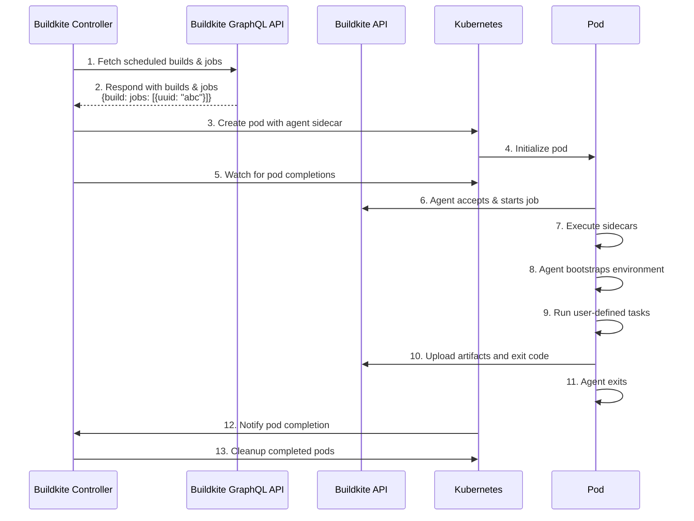

# Buildkite Agent Stack for Kubernetes

[](https://buildkite.com/buildkite-kubernetes-stack/kubernetes-agent-stack)

## Table of Contents
- [Overview](#Overview)
- [How does it work](#How-does-it-work)
- [Architecture](#Architecture)
- [Installation](#Installation)
  - [Requirements](#Requirements)
  - [Deploy with Helm](#Deploy-with-Helm)
  - [Options](#Options)
- [Sample Buildkite Pipeline](#Sample-Buildkite-Pipelines)
  - [Cloning repos via SSH](#Cloning-repos-via-SSH)
  - [Cloning repos via HTTPS](#Cloning-repos-via-HTTPS)
  - [Pod Spec Patch](#Pod-Spec-Patch)
  - [Sidecars](#Sidecars)
  - [Extra volume mounts](#Extra-volume-mounts)
  - [Skipping checkout](#Skipping-checkout)
  - [Overriding flags for git clone/fetch](#Overriding-flags-for-git-clonefetch)
  - [Validating your pipeline](#Validating-your-pipeline)
- [Securing the stack](#securing-the-stack)
  - [Prohibiting the kubernetes plugin (v0.13.0 and later)](#prohibiting-the-kubernetes-plugin-v0130-and-later)
- [How to setup agent hooks](#How-to-setup-agent-hooks)
- [Debugging](#Debugging)
- [Open Questions](#Open-Questions)

## Overview

A Kubernetes controller that runs [Buildkite steps](https://buildkite.com/docs/pipelines/defining-steps) as [Kubernetes jobs](https://kubernetes.io/docs/concepts/workloads/controllers/job/).

## How does it work

The controller uses the [Buildkite GraphQL API](https://buildkite.com/docs/apis/graphql-api) to watch for scheduled work that uses the `kubernetes` plugin.

When a job is available, the controller will create a pod to acquire and run the job. It converts the [PodSpec](https://kubernetes.io/docs/reference/generated/kubernetes-api/v1.25/#podspec-v1-core) in the `kubernetes` plugin into a pod by:

- adding an init container to:
  - copy the agent binary onto the workspace volume
  - check that other container images pull successfully before starting
- adding a container to run the buildkite agent
- adding a container to clone the source repository
- modifying the user-specified containers to:
  - overwrite the entrypoint to the agent binary
  - run with the working directory set to the workspace

The entrypoint rewriting and ordering logic is heavily inspired by [the approach used in Tekton](https://github.com/tektoncd/pipeline/blob/933e4f667c19eaf0a18a19557f434dbabe20d063/docs/developers/README.md#entrypoint-rewriting-and-step-ordering).

## Architecture

## Installation

### Requirements

- A Kubernetes cluster (GKE, AKS, etc.)
- An API token with the [GraphQL scope enabled](https://buildkite.com/docs/apis/graphql-api#authentication)
- An [agent token](https://buildkite.com/docs/agent/v3/tokens)
- A Cluster UUID (if using [Buildkite Clusters](https://buildkite.com/docs/agent/clusters))


### Creating the K8s cluster

**(For simplicity, this guide uses AWS EKS, but you can use any cloud provider or on-premises Kubernetes cluster.)**

To begin, we need to create the infrastuture that we are going to deploy our Agent into. 

You will need to download and install `eksctl` first by following the [official installation guide](https://eksctl.io/installation/)

Once installed, you can run the following `eksctl` command to create the infrusturcutre in AWS (VPC, Subnets, Security Groups, etc).

```console
eksctl create cluster --name agent-stack-ks \
    --region <your AWS region> \
    --nodegroup-name buildkite-nodes \
    --nodes-min 3 \
    --nodes-max 6 \
    --max-pods-per-node 5 -N 4
```

<details>
<summary>Example of the expected output:</summary>


```
eksctl create cluster --name buildkite-k8-cluster --region ap-southeast-2 --nodegroup-name buildkite-nodes --nodes-min 3 --nodes-max 6 --max-pods-per-node 5 -N 4
2024-12-18 10:37:24 [ℹ]  eksctl version 0.198.0-dev+8c015c84d.2024-12-10T17:20:22Z
2024-12-18 10:37:24 [ℹ]  using region ap-southeast-2
2024-12-18 10:37:24 [ℹ]  setting availability zones to [ap-southeast-2b ap-southeast-2a ap-southeast-2c]
2024-12-18 10:37:24 [ℹ]  subnets for ap-southeast-2b - public:192.168.0.0/19 private:192.168.96.0/19
2024-12-18 10:37:24 [ℹ]  subnets for ap-southeast-2a - public:192.168.32.0/19 private:192.168.128.0/19
2024-12-18 10:37:24 [ℹ]  subnets for ap-southeast-2c - public:192.168.64.0/19 private:192.168.160.0/19
2024-12-18 10:37:24 [ℹ]  nodegroup "buildkite-nodes" will use "" [AmazonLinux2/1.30]
2024-12-18 10:37:24 [ℹ]  using Kubernetes version 1.30
2024-12-18 10:37:24 [ℹ]  creating EKS cluster "buildkite-k8-cluster" in "ap-southeast-2" region with managed nodes
2024-12-18 10:37:24 [ℹ]  will create 2 separate CloudFormation stacks for cluster itself and the initial managed nodegroup
2024-12-18 10:37:24 [ℹ]  if you encounter any issues, check CloudFormation console or try 'eksctl utils describe-stacks --region=ap-southeast-2 --cluster=buildkite-k8-cluster'
2024-12-18 10:37:24 [ℹ]  Kubernetes API endpoint access will use default of {publicAccess=true, privateAccess=false} for cluster "buildkite-k8-cluster" in "ap-southeast-2"
2024-12-18 10:37:24 [ℹ]  CloudWatch logging will not be enabled for cluster "buildkite-k8-cluster" in "ap-southeast-2"
2024-12-18 10:37:24 [ℹ]  you can enable it with 'eksctl utils update-cluster-logging --enable-types={SPECIFY-YOUR-LOG-TYPES-HERE (e.g. all)} --region=ap-southeast-2 --cluster=buildkite-k8-cluster'
2024-12-18 10:37:24 [ℹ]  default addons vpc-cni, kube-proxy, coredns were not specified, will install them as EKS addons
2024-12-18 10:37:24 [ℹ]  
2 sequential tasks: { create cluster control plane "buildkite-k8-cluster", 
    2 sequential sub-tasks: { 
        2 sequential sub-tasks: { 
            1 task: { create addons },
            wait for control plane to become ready,
        },
        create managed nodegroup "buildkite-nodes",
    } 
}
2024-12-18 10:37:24 [ℹ]  building cluster stack "eksctl-buildkite-k8-cluster-cluster"
2024-12-18 10:37:25 [ℹ]  deploying stack "eksctl-buildkite-k8-cluster-cluster"
2024-12-18 10:37:55 [ℹ]  waiting for CloudFormation stack "eksctl-buildkite-k8-cluster-cluster"
2024-12-18 10:38:25 [ℹ]  waiting for CloudFormation stack "eksctl-buildkite-k8-cluster-cluster"
2024-12-18 10:39:25 [ℹ]  waiting for CloudFormation stack "eksctl-buildkite-k8-cluster-cluster"
2024-12-18 10:40:25 [ℹ]  waiting for CloudFormation stack "eksctl-buildkite-k8-cluster-cluster"
2024-12-18 10:41:25 [ℹ]  waiting for CloudFormation stack "eksctl-buildkite-k8-cluster-cluster"
2024-12-18 10:42:25 [ℹ]  waiting for CloudFormation stack "eksctl-buildkite-k8-cluster-cluster"
2024-12-18 10:43:26 [ℹ]  waiting for CloudFormation stack "eksctl-buildkite-k8-cluster-cluster"
2024-12-18 10:44:26 [ℹ]  waiting for CloudFormation stack "eksctl-buildkite-k8-cluster-cluster"
2024-12-18 10:45:26 [ℹ]  waiting for CloudFormation stack "eksctl-buildkite-k8-cluster-cluster"
2024-12-18 10:46:26 [ℹ]  waiting for CloudFormation stack "eksctl-buildkite-k8-cluster-cluster"
2024-12-18 10:46:27 [!]  recommended policies were found for "vpc-cni" addon, but since OIDC is disabled on the cluster, eksctl cannot configure the requested permissions; the recommended way to provide IAM permissions for "vpc-cni" addon is via pod identity associations; after addon creation is completed, add all recommended policies to the config file, under `addon.PodIdentityAssociations`, and run `eksctl update addon`
2024-12-18 10:46:27 [ℹ]  creating addon
2024-12-18 10:46:28 [ℹ]  successfully created addon
2024-12-18 10:46:28 [ℹ]  creating addon
2024-12-18 10:46:29 [ℹ]  successfully created addon
2024-12-18 10:46:29 [ℹ]  creating addon
2024-12-18 10:46:29 [ℹ]  successfully created addon
2024-12-18 10:48:30 [ℹ]  building managed nodegroup stack "eksctl-buildkite-k8-cluster-nodegroup-buildkite-nodes"
2024-12-18 10:48:31 [ℹ]  deploying stack "eksctl-buildkite-k8-cluster-nodegroup-buildkite-nodes"
2024-12-18 10:48:31 [ℹ]  waiting for CloudFormation stack "eksctl-buildkite-k8-cluster-nodegroup-buildkite-nodes"
2024-12-18 10:49:01 [ℹ]  waiting for CloudFormation stack "eksctl-buildkite-k8-cluster-nodegroup-buildkite-nodes"
2024-12-18 10:49:37 [ℹ]  waiting for CloudFormation stack "eksctl-buildkite-k8-cluster-nodegroup-buildkite-nodes"
2024-12-18 10:51:33 [ℹ]  waiting for CloudFormation stack "eksctl-buildkite-k8-cluster-nodegroup-buildkite-nodes"
2024-12-18 10:51:33 [ℹ]  waiting for the control plane to become ready
2024-12-18 10:51:33 [✔]  saved kubeconfig as "/Users/jykingston/.kube/config"
2024-12-18 10:51:33 [ℹ]  no tasks
2024-12-18 10:51:33 [✔]  all EKS cluster resources for "buildkite-k8-cluster" have been created
2024-12-18 10:51:34 [ℹ]  nodegroup "buildkite-nodes" has 4 node(s)
2024-12-18 10:51:34 [ℹ]  node "ip-192-168-23-49.ap-southeast-2.compute.internal" is ready
2024-12-18 10:51:34 [ℹ]  node "ip-192-168-59-61.ap-southeast-2.compute.internal" is ready
2024-12-18 10:51:34 [ℹ]  node "ip-192-168-78-38.ap-southeast-2.compute.internal" is ready
2024-12-18 10:51:34 [ℹ]  node "ip-192-168-94-142.ap-southeast-2.compute.internal" is ready
2024-12-18 10:51:34 [ℹ]  waiting for at least 3 node(s) to become ready in "buildkite-nodes"
2024-12-18 10:51:34 [ℹ]  nodegroup "buildkite-nodes" has 4 node(s)
2024-12-18 10:51:34 [ℹ]  node "ip-192-168-23-49.ap-southeast-2.compute.internal" is ready
2024-12-18 10:51:34 [ℹ]  node "ip-192-168-59-61.ap-southeast-2.compute.internal" is ready
2024-12-18 10:51:34 [ℹ]  node "ip-192-168-78-38.ap-southeast-2.compute.internal" is ready
2024-12-18 10:51:34 [ℹ]  node "ip-192-168-94-142.ap-southeast-2.compute.internal" is ready
2024-12-18 10:51:34 [✔]  created 1 managed nodegroup(s) in cluster "buildkite-k8-cluster"
2024-12-18 10:51:34 [ℹ]  kubectl command should work with "/Users/jykingston/.kube/config", try 'kubectl get nodes'
2024-12-18 10:51:34 [✔]  EKS cluster "buildkite-k8-cluster" in "ap-southeast-2" region is ready
```

</details>

### Deploying K8's stack using Helm

The simplest way to get up and running is by deploying the Helm chart, which simplifies the process of installing and managing Buildkite agents on your Kubernetes cluster.

```console
helm upgrade --install agent-stack-k8s oci://ghcr.io/buildkite/helm/agent-stack-k8s \
    --create-namespace \
    --namespace buildkite \
    --set config.org=<your Buildkite org slug> \
    --set agentToken=<your Buildkite agent token> \
    --set graphqlToken=<your Buildkite GraphQL-enabled API token> \
    --set config.cluster-uuid=<your cluster's UUID>
```
<details>
<summary>Example of the expected output</summary>

```
Release "agent-stack-k8s" does not exist. Installing it now.
Pulled: ghcr.io/buildkite/helm/agent-stack-k8s:0.20.2
Digest: sha256:3d3153bfaa2ecbe42db36b6ee241b7f5c0e2f5b04517afb542e5a3d65a6ca597
NAME: agent-stack-k8s
LAST DEPLOYED: Thu Dec 19 09:54:47 2024
NAMESPACE: default
STATUS: deployed
REVISION: 1
TEST SUITE: None
```

</details>

To obtain the cluster's UUID, you will need to navigate to the [Agents page](https://buildkite.com/organizations/-/clusters), select the required cluster and then select the "Settings". Here you will find the UUID listed in the "GraphQL API Integration" section as the first value.

The Cluster UUID can also be you can specifed in a values file:

```yaml
# values.yaml
config:
  cluster-uuid: beefcafe-abbe-baba-abba-deedcedecade
```

> [!NOTE]
> Don't confuse the Cluster UUID with the UUID for the Queue. See [the docs](https://buildkite.com/docs/clusters/overview) for an explanation.


> [!NOTE]
> If you are using an unclustered setup, you can omit the `config.cluster-uuid` parameter.


We're using Helm's support for [OCI-based registries](https://helm.sh/docs/topics/registries/),
which means you'll need Helm version 3.8.0 or newer.

This will create an agent-stack-k8s installation that will listen to the `kubernetes` queue.
See the `--tags` [option](#Options) for specifying a different queue.

### Options

```text
Usage:
  agent-stack-k8s [flags]
  agent-stack-k8s [command]

Available Commands:
  completion  Generate the autocompletion script for the specified shell
  help        Help about any command
  lint        A tool for linting Buildkite pipelines
  version     Prints the version

Flags:
      --agent-token-secret string                  name of the Buildkite agent token secret (default "buildkite-agent-token")
      --buildkite-token string                     Buildkite API token with GraphQL scopes
      --cluster-uuid string                        UUID of the Buildkite Cluster. The agent token must be for the Buildkite Cluster.
  -f, --config string                              config file path
      --debug                                      debug logs
  -h, --help                                       help for agent-stack-k8s
      --image string                               The image to use for the Buildkite agent (default "ghcr.io/buildkite/agent:3.78.0")
      --image-pull-backoff-grace-period duration   Duration after starting a pod that the controller will wait before considering cancelling a job due to ImagePullBackOff (e.g. when the podSpec specifies container images that cannot be pulled) (default 30s)
      --job-ttl duration                           time to retain kubernetes jobs after completion (default 10m0s)
      --max-in-flight int                          max jobs in flight, 0 means no max (default 25)
      --namespace string                           kubernetes namespace to create resources in (default "default")
      --org string                                 Buildkite organization name to watch
      --poll-interval duration                     time to wait between polling for new jobs (minimum 1s); note that increasing this causes jobs to be slower to start (default 1s)
      --profiler-address string                    Bind address to expose the pprof profiler (e.g. localhost:6060)
      --prohibit-kubernetes-plugin                 Causes the controller to prohibit the kubernetes plugin specified within jobs (pipeline YAML) - enabling this causes jobs with a kubernetes plugin to fail, preventing the pipeline YAML from having any influence over the podSpec
      --tags strings                               A comma-separated list of agent tags. The "queue" tag must be unique (e.g. "queue=kubernetes,os=linux") (default [queue=kubernetes])

Use "agent-stack-k8s [command] --help" for more information about a command.
```

Configuration can also be provided by a config file (`--config` or `CONFIG`), or environment variables. In the [examples](examples) folder there is a sample [YAML config](examples/config.yaml) and a sample [dotenv config](examples/config.env).

#### Externalize Secrets

You can also have an external provider create a secret for you in the namespace before deploying the chart with helm. If the secret is pre-provisioned, replace the `agentToken` and `graphqlToken` arguments with:

```console
--set agentStackSecret=<secret-name>
```

The format of the required secret can be found in [this file](./charts/agent-stack-k8s/templates/secrets.yaml.tpl).

#### Other Installation Methods

You can also use this chart as a dependency:

```yaml
dependencies:
- name: agent-stack-k8s
  version: "0.5.0"
  repository: "oci://ghcr.io/buildkite/helm"
```

or use it as a template:

```console
helm template oci://ghcr.io/buildkite/helm/agent-stack-k8s -f my-values.yaml
```

Available versions and their digests can be found on [the releases page](https://github.com/buildkite/agent-stack-k8s/releases).

## Sample Buildkite Pipelines

For simple commands, you merely have to target the queue you configured agent-stack-k8s with.
```yaml
steps:
- label: Hello World!
  command: echo Hello World!
  agents:
    queue: kubernetes
```
For more complicated steps, you have access to the [`PodSpec`](https://kubernetes.io/docs/reference/generated/kubernetes-api/v1.29/#podspec-v1-core) Kubernetes API resource that will be used in a Kubernetes [`Job`](https://kubernetes.io/docs/reference/generated/kubernetes-api/v1.29/#job-v1-batch).
For now, this is nested under a `kubernetes` plugin.
But unlike other Buildkite plugins, there is no corresponding plugin repository.
Rather, this is syntax that is interpreted by the `agent-stack-k8s` controller.
```yaml
steps:
- label: Hello World!
  agents:
    queue: kubernetes
  plugins:
  - kubernetes:
      podSpec:
        containers:
        - image: alpine:latest
          command:
          - echo Hello World!
```

Almost any container image may be used, but it MUST have a POSIX shell available to be executed at `/bin/sh`.

### PodSpec command and args interpretation

In a `podSpec`, `command` **must** be a list of strings, since it is [defined by Kubernetes](https://kubernetes.io/docs/reference/kubernetes-api/workload-resources/pod-v1/#entrypoint).
However, agent-stack-k8s runs buildkite-agent instead of the container's default entrypoint.
To run the command you want, it must _re-interpret_ `command` into input for buildkite-agent.
By default, it treats `command` as a sequence of multiple commands, similar to a pipeline.yaml
`steps: commands: ...`.
This is different to Kubernetes' interpretation of `command` (as an entrypoint vector run without a
shell as a single command).

This "interposer" behaviour can be changed using `commandParams/interposer`:

* `buildkite` is the default, in which agent-stack-k8s treats `command` as a sequence of multiple
  commands and `args` as extra arguments added to the end of the last command, which is then
  typically interpreted by the shell.
* `vector` emulates the Kubernetes interpretation in which `command` and `args` specify components
  of a single command intended to be run directly.
* `legacy` is the 0.14.0 and earlier behaviour in which `command` and `args` were joined directly
  into a single command with spaces.

`buildkite` example:

```yaml
steps:
- label: Hello World!
  agents:
    queue: kubernetes
  plugins:
  - kubernetes:
      commandParams:
        interposer: buildkite  # This is the default, and can be omitted.
      podSpec:
        containers:
        - image: alpine:latest
          command:
          - set -euo pipefail
          - |-       # <-- YAML block scalars work too
            echo Hello World! > hello.txt
            cat hello.txt | buildkite-agent annotate
```

If you have a multi-line `command`, specifying the `args` as well could lead to confusion, so we
recommend just using `command`.

`vector` example:

```yaml
steps:
- label: Hello World!
  agents:
    queue: kubernetes
  plugins:
  - kubernetes:
      commandParams:
        interposer: vector
      podSpec:
        containers:
        - image: alpine:latest
          command: ['sh']
          args:
          - '-c'
          - |-
            set -eu

            echo Hello World! > hello.txt
            cat hello.txt | buildkite-agent annotate
```

More samples can be found in the
[integration test fixtures directory](internal/integration/fixtures).

### Cloning repos via SSH

To use SSH to clone your repos, you'll need to add a secret reference via an [EnvFrom](https://kubernetes.io/docs/reference/generated/kubernetes-api/v1.25/#envfromsource-v1-core) to your pipeline to specify where to mount your SSH private key from.
Place this object under a `gitEnvFrom` key in the `kubernetes` plugin (see the example below).

You should create a secret in your namespace with an environment variable name that's recognised by [`docker-ssh-env-config`](https://github.com/buildkite/docker-ssh-env-config).
A script from this project is included in the default entrypoint of the default [`buildkite/agent`](https://hub.docker.com/r/buildkite/agent) Docker image.
It will process the value of the secret and write out a private key to the `~/.ssh` directory of the checkout container.

However this key will not be available in your job containers.
If you need to use git ssh credentials in your job containers, we recommend one of the following options:
1. Use a container image that's based on the default `buildkite/agent` docker image and preserve the default entrypoint by not overriding the command in the job spec.
2. Include or reproduce the functionality of the [`ssh-env-config.sh`](https://github.com/buildkite/docker-ssh-env-config/blob/-/ssh-env-config.sh) script in the entrypoint for your job container image

#### Example secret creation for ssh cloning
You most likely want to use a more secure method of managing k8s secrets. This example is illustrative only.

Supposing a SSH private key has been created and its public key has been registered with the remote repository provider (e.g. [GitHub](https://docs.github.com/en/authentication/connecting-to-github-with-ssh/adding-a-new-ssh-key-to-your-github-account)).
```console
kubectl create secret generic my-git-ssh-credentials --from-file=SSH_PRIVATE_DSA_KEY="$HOME/.ssh/id_ecdsa"
```

Then the following pipeline will be able to clone a git repository that requires ssh credentials.
```yaml
steps:
  - label: build image
    agents:
      queue: kubernetes
    plugins:
      - kubernetes:
          gitEnvFrom:
            - secretRef:
                name: my-git-ssh-credentials # <----
          podSpec:
            containers:
              - image: gradle:latest
                command: [gradle]
                args:
                  - jib
                  - --image=ttl.sh/example:1h
```

### Cloning repos via HTTPS

To use HTTPS to clone private repos, you can use a `.git-credentials` file stored in a secret, and
refer to this secret using the `gitCredentialsSecret` checkout parameter.

By default, this secret is only attached, and Git is only configured to use it, within the
`checkout` container. It will not necessarily be available in your job containers.
If you need the `.git-credentials` file inside the other containers as well, you can add a volume
mount for the `git-credentials` volume, and configure Git to use the file within it (e.g. with
`git config credential.helper 'store --file ...'`)

#### Example secret creation for HTTPS cloning
Once again, this example is illustrative only.

First, create a Kubernetes secret containing the key `.git-credentials`, formatted in the manner
expected by [the `store` Git credendial helper](https://git-scm.com/docs/git-credential-store):

```console
kubectl create secret generic my-git-credentials --from-file='.git-credentials'="$HOME/.git-credentials"
```

Then you can use the `checkout/gitCredentialsSecret` (in your pipeline) or
`default-checkout-params/gitCredentialsSecret` (in values.yaml) to reference the secret volume
source:

```yaml
# pipeline.yaml
steps:
  - label: build image
    agents:
      queue: kubernetes
    plugins:
      - kubernetes:
          checkout:
            gitCredentialsSecret:
              secretName: my-git-credentials # <----
          podSpec:
            ...
```

```yaml
# values.yaml
...
default-checkout-params:
  gitCredentialsSecret:
    secretName: my-git-credentials
...
```

If you wish to use a different key within the secret than `.git-credentials`, you can
[project it](https://kubernetes.io/docs/tasks/inject-data-application/distribute-credentials-secure/#project-secret-keys-to-specific-file-paths)
to `.git-credentials` by using `items` within `gitCredentialsSecret`.

```yaml
# values.yaml
...
default-checkout-params:
  gitCredentialsSecret:
    secretName: my-git-credentials
    items:
    - key: funky-creds
      path: .git-credentials
...
```

### Default job metadata
agent-stack-k8s can automatically add labels and annotations to the Kubernetes jobs it creates.
Default labels and annotations can be set in `values.yaml` with `default-metadata`, e.g.:

```yaml
# config.yaml / values.yaml
...
default-metadata:
  annotations:
    imageregistry: "https://hub.docker.com/"
    mycoolannotation: llamas
  labels:
    argocd.argoproj.io/tracking-id: example-id-here
    mycoollabel: alpacas
```

Similarly they can be set for each step in a pipeline individually using the kubernetes plugin,
e.g.:

```yaml
# pipeline.yaml
...
  plugins:
    - kubernetes:
        metadata:
          annotations:
            imageregistry: "https://hub.docker.com/"
            mycoolannotation: llamas
          labels:
            argocd.argoproj.io/tracking-id: example-id-here
            mycoollabel: alpacas
```


### Pod Spec Patch
Rather than defining the entire Pod Spec in a step, there is the option to define a [strategic merge patch](https://kubernetes.io/docs/tasks/manage-kubernetes-objects/update-api-object-kubectl-patch/) in the controller.
Agent Stack K8s will first generate a K8s Job with a PodSpec from a Buildkite Job and then apply the patch in the controller.
It will then apply the patch specified in its config file, which is derived from the value in the helm installation.
This can replace much of the functionality of some of the other fields in the plugin, like `gitEnvFrom`.

#### Eliminate `gitEnvFrom`
Here's an example demonstrating how one would eliminate the need to specify `gitEnvFrom` from every step, but still checkout private repositories.

First, deploy the helm chart with a `values.yaml` file.
```yaml
# values.yaml
agentStackSecret: <name of predefined secrets for k8s>
config:
  org: <your-org-slug>
  pod-spec-patch:
    containers:
    - name: checkout         # <---- this is needed so that the secret will only be mounted on the checkout container
      envFrom:
      - secretRef:
          name: git-checkout # <---- this is the same secret name you would have put in `gitEnvFrom` in the kubernetes plugin
```
You may use the `-f` or `--values` arguments to `helm upgrade` to specify a `values.yaml` file.
```console
helm upgrade --install agent-stack-k8s oci://ghcr.io/buildkite/helm/agent-stack-k8s \
    --create-namespace \
    --namespace buildkite \
    --values values.yaml \
    --version <agent-stack-k8s version>
```

Now, with this setup, we don't even need to specify the `kubernetes` plugin to use Agent Stack K8s with a private repo
```yaml
# pipelines.yaml
agents:
  queue: kubernetes
steps:
- name: Hello World!
  commands:
  - echo -n Hello!
  - echo " World!"

- name: Hello World in one command
  command: |-
    echo -n Hello!
    echo " World!"
```

#### Custom Images
You can specify a different image to use for a step in a step level `podSpecPatch`. Previously this could be done with a step level `podSpec`.
```yaml
# pipelines.yaml
agents:
  queue: kubernetes
steps:
- name: Hello World!
  commands:
  - echo -n Hello!
  - echo " World!"
  plugins:
  - kubernetes:
      podSpecPatch:
      - name: container-0
        image: alpine:latest

- name: Hello World from alpine!
  commands:
  - echo -n Hello
  - echo " from alpine!"
  plugins:
  - kubernetes:
      podSpecPatch:
      - name: container-0      # <---- You must specify this as exactly `container-0` for now.
        image: alpine:latest   #       We are experimenting with ways to make it more ergonomic
```

#### Default Resources
In the helm values, you can specify default resources to be used by the containers in Pods that are launched to run Jobs.
```yaml
# values.yaml
agentStackSecret: <name of predefend secrets for k8s>
config:
  org: <your-org-slug>
  pod-spec-patch:
    initContainers:
    - name: copy-agent
    requests:
      cpu: 100m
      memory: 50Mi
    limits:
      memory: 100Mi
    containers:
    - name: agent          # this container acquires the job
      resources:
        requests:
          cpu: 100m
          memory: 50Mi
        limits:
          memory: 1Gi
    - name: checkout       # this container clones the repo
      resources:
        requests:
          cpu: 100m
          memory: 50Mi
        limits:
          memory: 1Gi
    - name: container-0    # the job runs in a container with this name by default
      resources:
        requests:
          cpu: 100m
          memory: 50Mi
        limits:
          memory: 1Gi
```
and then every job that's handled by this installation of agent-stack-k8s will default to these values. To override it for a step, use a step level `podSpecPatch`.
```yaml
# pipelines.yaml
agents:
  queue: kubernetes
steps:
- name: Hello from a container with more resources
  command: echo Hello World!
  plugins:
  - kubernetes:
      podSpecPatch:
        containers:
        - name: container-0    # <---- You must specify this as exactly `container-0` for now.
          resources:           #       We are experimenting with ways to make it more ergonomic
            requests:
              cpu: 1000m
              memory: 50Mi
            limits:
              memory: 1Gi

- name: Hello from a container with default resources
  command: echo Hello World!
```

### Sidecars

Sidecar containers can be added to your job by specifying them under the top-level `sidecars` key. See [this example](internal/integration/fixtures/sidecars.yaml) for a simple job that runs `nginx` as a sidecar, and accesses the nginx server from the main job.

There is no guarantee that your sidecars will have started before your job, so using retries or a tool like [wait-for-it](https://github.com/vishnubob/wait-for-it) is a good idea to avoid flaky tests.

### The workspace volume

By default the workspace directory (`/workspace`) is mounted as an `emptyDir` ephemeral volume. Other volumes may be more desirable (e.g. a volume claim backed by an NVMe device).
The default workspace volume can be set as stack configuration, e.g.

```yaml
# values.yaml
config:
  workspace-volume:
    name: workspace-2-the-reckoning
    ephemeral:
      volumeClaimTemplate:
        spec:
          accessModes: ["ReadWriteOnce"]
          storageClassName: my-special-storage-class
          resources:
            requests:
              storage: 1Gi
```

### Extra volume mounts

In some situations, for example if you want to use [git mirrors](https://buildkite.com/docs/agent/v3#promoted-experiments-git-mirrors) you may want to attach extra volume mounts (in addition to the `/workspace` one) in all the pod containers.

See [this example](internal/integration/fixtures/extra-volume-mounts.yaml), that will declare a new volume in the `podSpec` and mount it in all the containers. The benefit, is to have the same mounted path in all containers, including the `checkout` container.

### Skipping checkout (v0.13.0 and later)

For some steps, you may wish to avoid checkout (cloning a source repository).
This can be done with the `checkout` block under the `kubernetes` plugin:

```yaml
steps:
- label: Hello World!
  agents:
    queue: kubernetes
  plugins:
  - kubernetes:
      checkout:
        skip: true # prevents scheduling the checkout container
```

### Overriding flags for git clone and git fetch (v0.13.0 and later)

Flags for `git clone`, `git fetch` can be overridden per-step (similar to
`BUILDKITE_GIT_CLONE_FLAGS` and `BUILDLKITE_GIT_FETCH_FLAGS` env vars) with
the `checkout` block also:

```yaml
# pipeline.yml
steps:
- label: Hello World!
  agents:
    queue: kubernetes
  plugins:
  - kubernetes:
      checkout:
        cloneFlags: -v --depth 1
        fetchFlags: -v --prune --tags
```

### Overriding other git settings (v0.16.0 and later)

From v0.16.0 onwards, many more git flags and options supported by the agent are
also configurable with the `checkout` block. Example:

```yaml
# pipeline.yml
steps:
- label: Hello World!
  agents:
    queue: kubernetes
  plugins:
  - kubernetes:
      checkout:
        cleanFlags: -ffxdq
        noSubmodules: false
        submoduleCloneConfig: ["key=value", "something=else"]
        gitMirrors:
          path: /buildkite/git-mirrors # optional with volume
          volume:
            name: my-special-git-mirrors
            persistentVolumeClaim:
              claimName: block-pvc
          lockTimeout: 600
          skipUpdate: true
          cloneFlags: -v
```

To avoid setting `checkout` on every step, you can use `default-checkout-params`
within `values.yaml` when deploying the stack. These will apply the settings to
every job. Example:

```yaml
# values.yaml
...
config:
  default-checkout-params:
    # The available options are the same as `checkout` within `plugin.kubernetes`.
    cloneFlags: -v --depth 1
    noSubmodules: true
    gitMirrors:
      volume:
        name: host-git-mirrors
        hostPath:
          path: /var/lib/buildkite/git-mirrors
          type: Directory
```

### Default envFrom

`envFrom` can be added to all checkout, command, and sidecar containers
separately, either per-step in the pipeline or for all jobs in `values.yaml`.

Pipeline example (note that the blocks are `checkout`, `commandParams`, and
`sidecarParams`):

```yaml
# pipeline.yml
...
  kubernetes:
    checkout:
      envFrom:
      - prefix: GITHUB_
        secretRef:
          name: github-secrets
    commandParams:
      interposer: vector
      envFrom:
      - prefix: DEPLOY_
        secretRef:
          name: deploy-secrets
    sidecarParams:
      envFrom:
      - prefix: LOGGING_
        configMapRef:
          name: logging-config
```

`values.yaml` example:

```yaml
# values.yml
config:
  default-checkout-params:
    envFrom:
    - prefix: GITHUB_
      secretRef:
        name: github-secrets
  default-command-params:
    interposer: vector
    envFrom:
    - prefix: DEPLOY_
      secretRef:
        name: deploy-secrets
  default-sidecar-params:
    envFrom:
    - prefix: LOGGING_
      configMapRef:
        name: logging-config
```

## Setting agent configuration (v0.16.0 and later)

The `agent-config` block within `values.yaml` can be used to set a subset of
[the agent configuration file options](https://buildkite.com/docs/agent/v3/configuration).

```yaml
# values.yaml
config:
  agent-config:
    no-http2: false
    experiment: ["use-zzglob", "polyglot-hooks"]
    shell: "/bin/bash"
    no-color: false
    strict-single-hooks: true
    no-multipart-artifact-upload: false
    trace-context-encoding: json
    disable-warnings-for: ["submodules-disabled"]
    no-pty: false
    no-command-eval: true
    no-local-hooks: true
    no-plugins: true
    plugin-validation: false
```

Note that, even if `no-command-eval` or `no-plugins` is enabled, the Kubernetes
plugin may still be able to override everything, since it is interpreted by the
stack controller, not the agent. `no-command-eval` or `no-plugins` should be
used together with `prohibit-kubernetes-plugin` (described below).

## How to set up pipeline signing (v0.16.0 and later)

The `agent-config` block within `values.yaml` accepts most of the
[Signed Pipelines](https://buildkite.com/docs/agent/v3/signed-pipelines) options.

Additionally, volume sources for signing and verification keys can be specified,
and automatically attached to the right containers.

Any volume source can be specified for keys, but a common choice is to use a
`secret` source. Keys are generally small, distributed across the cluster,
and ideally are never shown in plain text.

1.  Create one or two secrets containing signing and verification keys:
    ```console
    kubectl create secret generic my-signing-key --from-file='key'="$HOME/private.jwk"
    kubectl create secret generic my-verification-key --from-file='key'="$HOME/public.jwk"
    ```

2.  Add `values.yaml` configuration to use the volumes:

    ```yaml
    # values.yaml
    config:
      agent-config:
        # The signing key will be attached to command containers, so it can be
        # used by 'buildkite-agent pipeline upload'.
        signing-jwks-file: key # optional if the file within the volume is called "key"
        signing-jwks-key-id: llamas # optional
        signingJWKSVolume:
          name: buildkite-signing-jwks
          secret:
            secretName: my-signing-key
        # The verification key will be attached to the 'agent start' container.
        verification-jwks-file: key # optional if the file within the volume is called "key"
        verification-failure-behavior: warn # for testing/incremental rollout, use 'block' to enforce
        verificationJWKSVolume:
          name: buildkite-verification-jwks
          secret:
            secretName: my-verification-key
    ```


Note that `signing-jwks-file` and `verification-jwks-file` agent config options
can be used to either change the mount point of the corresponding volume (with
an absolute path) or specify a file within the volume (with a relative path).
The default mount points are `/buildkite/signing-jwks` and
`/buildkite/verification-jwks`.

## How to set up agent hooks and plugins (v0.16.0 and later)

The `agent-config` block within `values.yaml` accepts a `hookVolumeSource`
and `pluginVolumeSource`. If used, the corresponding volumes are named
`buildkite-hooks` and `buildkite-plugins`, and will be automatically
mounted on checkout and command containers, with the agent configured to use them.

Any volume source can be specified for agent hooks and plugins, but a common
choice is to use a `configMap`, since hooks generally aren't very big and
config maps are made available across the cluster.

1.  Create the config map containing hooks:
    ```console
    kubectl create configmap buildkite-agent-hooks --from-file=/tmp/hooks -n buildkite
    ```

2.  Example of using hooks from a config map:
    ```yaml
    # values.yaml
    config:
      agent-config:
        hooksVolume:
          name: buildkite-hooks
          configMap:
            defaultMode: 493
            name: buildkite-agent-hooks
    ```

    Example of using plugins from a host path
    ([_caveat lector_](https://kubernetes.io/docs/concepts/storage/volumes/#hostpath)):

    ```yaml
    # values.yaml
    config:
      agent-config:
        pluginsVolume:
          name: buildkite-plugins
          hostPath:
            type: Directory
            path: /etc/buildkite-agent/plugins
    ```

Note that `hooks-path` and `plugins-path` agent config options can be used to
change the mount point of the corresponding volume. The default mount points are
`/buildkite/hooks` and `/buildkite/plugins`.

## How to set up agent hooks (v0.15.0 and earlier)

This section explains how to setup agent hooks when running Agent Stack K8s. In order for the agent hooks to work, they must be present on the instances where the agent runs.

In case of agent-stack-k8s, we need these hooks to be accessible to the kubernetes pod where the `checkout` and `command` containers will be running. Best way to make this happen is to create a configmap with the agent hooks and mount the configmap as volume to the containers.

Here is the command to create `configmap` which will have agent hooks in it:

```console
kubectl create configmap buildkite-agent-hooks --from-file=/tmp/hooks -n buildkite
```
We have all the hooks under directory `/tmp/hooks` and we are creating `configmap` with name `buildkite-agent-hooks` in `buildkite`
namespace in the k8s cluster.

Here is how to make these hooks in configmap available to the containers. Here is the pipeline
config for setting up agent hooks:

```yaml
# pipeline.yml
steps:
- label: ':pipeline: Pipeline Upload'
  agents:
    queue: kubernetes
  plugins:
  - kubernetes:
      extraVolumeMounts:
        - mountPath: /buildkite/hooks
          name: agent-hooks
      podSpec:
        containers:
        - command:
          - echo hello-world
          image: alpine:latest
          env:
          - name: BUILDKITE_HOOKS_PATH
            value: /buildkite/hooks
        volumes:
          - configMap:
              defaultMode: 493
              name: buildkite-agent-hooks
            name: agent-hooks
```

There are 3 main aspects we need to make sure that happen for hooks to be available to the containers in `agent-stack-k8s`.

1. Define env `BUILDKITE_HOOKS_PATH` with the path `agent ` and `checkout` containers will look for hooks

   ```yaml
          env:
          - name: BUILDKITE_HOOKS_PATH
            value: /buildkite/hooks
   ```

2. Define `VolumeMounts` using `extraVolumeMounts` which will be the path where the hooks will be mounted to with in the containers

   ```yaml
        extraVolumeMounts:
        - mountPath: /buildkite/hooks
          name: agent-hooks
   ```

3. Define `volumes` where the configmap will be mounted

   ```yaml
          volumes:
          - configMap:
              defaultMode: 493
              name: buildkite-agent-hooks
            name: agent-hooks
   ```
   Note: Here defaultMode `493` is setting the Unix permissions to `755` which enables the hooks to be executable. Also another way to make this hooks directory available to containers is to use [hostPath](https://kubernetes.io/docs/concepts/storage/volumes/#hostpath)
   mount but it is not a recommended approach for production environments.

Now when we run this pipeline agent hooks will be available to the container and will run them.

Key difference we will notice with hooks execution with `agent-stack-k8s` is that environment hooks will execute twice, but checkout-related hooks such as `pre-checkout`, `checkout` and `post-checkout`
will only be executed once in the `checkout` container. Similarly the command-related hooks like `pre-command`, `command` and `post-command` hooks will be executed once by the `command` container(s).

If the env `BUILDKITE_HOOKS_PATH` is set at pipeline level instead of container like shown in above pipeline config then hooks will run for both `checkout` container and `command` container(s).

Here is the pipeline config where env `BUILDKITE_HOOKS_PATH` is exposed to all containers in the pipeline:

```yaml
# pipeline.yml
steps:
- label: ':pipeline: Pipeline Upload'
  env:
    BUILDKITE_HOOKS_PATH: /buildkite/hooks
  agents:
    queue: kubernetes
  plugins:
  - kubernetes:
      extraVolumeMounts:
        - mountPath: /buildkite/hooks
          name: agent-hooks
      podSpec:
        containers:
        - command:
          - echo
          - hello-world
          image: alpine:latest
        volumes:
          - configMap:
              defaultMode: 493
              name: buildkite-agent-hooks
            name: agent-hooks
```

This is because agent-hooks will be present in both containers and `environment` hook will run in both containers. Here is how the build output will look like:

```
Running global environment hook
Running global pre-checkout hook
Preparing working directory
Running global post-checkout hook
Running global environment hook
Running commands
Running global pre-exit hook
```

In scenarios where we want to `skip checkout` when running on `agent-stack-k8s`, it will cause checkout-related hooks such as pre-checkout, checkout and post-checkout not to run because `checkout` container will not be present when `skip checkout` is set.

Here is the pipeline config where checkout is skipped:

```yaml
# pipeline.yml
steps:
- label: ':pipeline: Pipeline Upload'
  env:
    BUILDKITE_HOOKS_PATH: /buildkite/hooks
  agents:
    queue: kubernetes
  plugins:
  - kubernetes:
      checkout:
        skip: true
      extraVolumeMounts:
        - mountPath: /buildkite/hooks
          name: agent-hooks
      podSpec:
        containers:
        - command:
          - echo
          - hello-world
          image: alpine:latest
        volumes:
          - configMap:
              defaultMode: 493
              name: buildkite-agent-hooks
            name: agent-hooks
```

Now, if we look at the build output below, we can see that it only has `environment` and `pre-exit` that ran and no checkout-related hooks, unlike the earlier build output where checkout was not skipped.

```
Preparing working directory
Running global environment hook
Running commands
Running global pre-exit hook
```

### Validating your pipeline

With the unstructured nature of Buildkite plugin specs, it can be frustratingly
easy to mess up your configuration and then have to debug why your agent pods are failing to start.
To help prevent this sort of error, there's a linter that uses [JSON
schema](https://json-schema.org/) to validate the pipeline and plugin
configuration.

This currently can't prevent every sort of error, you might still have a reference to a Kubernetes volume that doesn't exist, or other errors of that sort, but it will validate that the fields match the API spec we expect.

Our JSON schema can also be used with editors that support JSON Schema by configuring your editor to validate against the schema found [here](./cmd/linter/schema.json).

## Securing the stack

### Prohibiting the kubernetes plugin (v0.13.0 and later)

Suppose you want to enforce the podSpec used for all jobs at the controller
level, and prevent users from setting or overriding that podSpec (or various
other parameters) through use of the kubernetes plugin.
This can be achieved with `prohibit-kubernetes-plugin`, either as a controller
flag or within the config `values.yaml`:

```yaml
# values.yaml
...
config:
  prohibit-kubernetes-plugin: true
  pod-spec-patch:
    # Override the default podSpec here.
  ...
```

With `prohibit-kubernetes-plugin` enabled, any job containing the kubernetes
plugin will fail.

## Debugging
Use the `log-collector` script in the `utils` folder to collect logs for agent-stack-k8s.

### Prerequisites

- kubectl binary
- kubectl setup and authenticated to correct k8s cluster

### Inputs to the script

k8s namespace where you deployed agent stack k8s and where you expect their k8s jobs to run.

Buildkite job id for which you saw issues.

### Data/logs gathered:

The script will collect kubectl describe of k8s job, pod and agent stack k8s controller pod.

It will also capture kubectl logs of k8s pod for the Buildkite job, agent stack k8s controller pod and package them in a
tar archive which you can send via email to support@buildkite.com.

## Open questions

- How to deal with stuck jobs? Timeouts?
- How to deal with pod failures (not job failures)?
  - Report failure to buildkite from controller?
  - Emit pod logs to buildkite? If agent isn't starting correctly
  - Retry?
