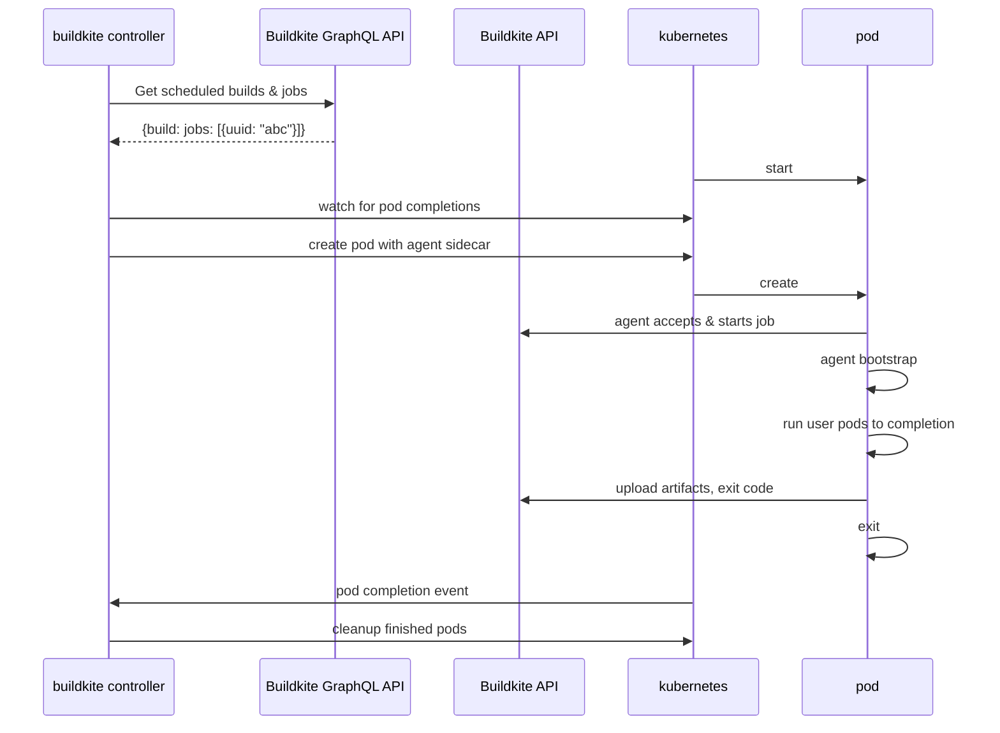

# Buildkite Agent Stack for Kubernetes

## Overview

A Kubernetes controller that runs Buildkite jobs as workloads on Kubernetes.

## Explain it like I'm 5

The controller uses the [Buildkite GraphQL API](https://buildkite.com/docs/apis/graphql-api) to watch for scheduled work that uses the `kubernetes` plugin.

When a job is available, the controller will create a pod to acquire and run the job. It converts the [PodSpec](https://kubernetes.io/docs/reference/generated/kubernetes-api/v1.25/#podspec-v1-core) in the `kubernetes` plugin into a pod by:

- adding an init container to:
  - copy the agent binary onto the workspace volume
- adding a container to run the buildkite agent
- adding a container to clone the source repository
- modifying the user-specified containers to:
  - overwrite the entrypoint to the agent binary
  - run with the working directory set to the workspace

The entrypoint rewriting and ordering logic is heavily inspired by [the approach used in Tekton](https://github.com/tektoncd/pipeline/blob/933e4f667c19eaf0a18a19557f434dbabe20d063/docs/developers/README.md#entrypoint-rewriting-and-step-ordering).

## Requirements

- A Kubernetes cluster and kubeconfig file
- An API token with the [GraphQL scope enabled](https://buildkite.com/docs/apis/graphql-api#authentication)
- An [agent token](https://buildkite.com/docs/agent/v3/tokens)

We use the [client-go default loading rules](https://pkg.go.dev/k8s.io/client-go/tools/clientcmd), which means we will check:

- The current context configured in `$HOME/.kube/config`
- In-cluster access via a service account token
- The `KUBECONFIG` environment variable

## Usage

First store the agent token in a Kubernetes secret:

```bash!
kubectl create secret generic buildkite-agent-token --from-literal=BUILDKITE_AGENT_TOKEN=my-agent-token
```

Next export the required environment variables and start the controller:

```bash!
export BUILDKITE_ORG=my-org
export BUILDKITE_TOKEN=my-api-token

agent-stack-k8s
```

### Options

```text
$ agent-stack-k8s --help
Usage of agent-stack-k8s:
      --agent-token-secret string   name of the Buildkite agent token secret (default "buildkite-agent-token")
      --buildkite-token string      Buildkite API token with GraphQL scopes
  -f, --config string               config file path
      --debug                       debug logs
      --image string                The image to use for the Buildkite agent (default "ghcr.io/buildkite/agent-k8s:latest")
      --job-ttl duration            time to retain kubernetes jobs after completion (default 10m0s)
      --max-in-flight int           max jobs in flight, 0 means no max (default 1)
      --namespace string            kubernetes namespace to create resources in (default "default")
      --org string                  Buildkite organization name to watch
      --tags strings                A comma-separated list of tags for the agent (for example, "linux" or "mac,xcode=8") (default [queue=kubernetes])
```

Configuration can also be provided by a config file (`--config` or `CONFIG`), or environment variables. In the [examples](examples) folder there is a sample [YAML config](examples/config.yaml) and a sample [dotenv config](examples/config.env).

## Architecture



## Sample buildkite pipeline

```yaml!
steps:
- label: build image
  plugins:
  - kubernetes:
      podSpec:
        containers:
        - image: gradle:latest
          command: [gradle]
          args:
          - jib
          - --image=ttl.sh/example:1h
```

## Cloning repos via SSH

To use SSH to clone your repos, you'll need to add a secret reference via an [EnvFrom](https://kubernetes.io/docs/reference/generated/kubernetes-api/v1.25/#envfromsource-v1-core) to your pipeline to specify where to mount your SSH private key from.

```yaml!
steps:
- label: build image
  plugins:
  - kubernetes:
      gitEnvFrom:
      - secretRef: {name: agent-stack-k8s} # <--
      podSpec:
        containers:
        - image: gradle:latest
          command: [gradle]
          args:
          - jib
          - --image=ttl.sh/example:1h
```

## Development

Install dependencies with Homebrew via:

```bash
brew bundle
```

Run tasks via [just](https://github.com/casey/just):

```bash
just --list
```

For running the integration tests you'll need to add some additional scopes to your Buildkite API token:

- `read_artifacts`
- `read_build_logs`

You'll also need to create an SSH secret in your cluster to run [this test pipeline](integration/fixtures/secretref.yaml). This SSH key needs to be associated with your GitHub account to be able to clone this public repo, and must be in a form acceptable to OpenSSH (aka `BEGIN OPENSSH PRIVATE KEY`, not `BEGIN PRIVATE KEY`).

```bash
kubectl create secret generic agent-stack-k8s --from-file=SSH_PRIVATE_RSA_KEY=$HOME/.ssh/id_github
```

### Deploying with Helm

`just deploy` will build the container image using [ko](https://ko.build/) and
deploy it with [Helm](https://helm.sh/).

You'll need to have set `KO_DOCKER_REPO` to a repository you have push access
to. For development something like the [kind local
registry](https://kind.sigs.k8s.io/docs/user/local-registry/) or the [minikube
registry](https://minikube.sigs.k8s.io/docs/handbook/registry) can be used. More
information is available at [ko's
website](https://ko.build/configuration/#local-publishing-options).

You'll also need to provide required configuration values to Helm, which can be done by passing extra args to `just`:

```bash
just deploy --values config.yaml
```

With config.yaml being a file containing [required Helm values](values.yaml), such as:

```yaml
agentToken: "abcdef"
graphqlToken: "12345"
config:
  org: "my-buildkite-org"
```

The `config` key contains configuration passed directly to the binary, and so supports all the keys documented in [the example](examples/config.yaml).

## Open questions

- How to deal with stuck jobs? Timeouts?
- How to deal with pod failures (not job failures)?
  - Report failure to buildkite from controller?
  - Emit pod logs to buildkite? If agent isn't starting correctly
  - Retry?
