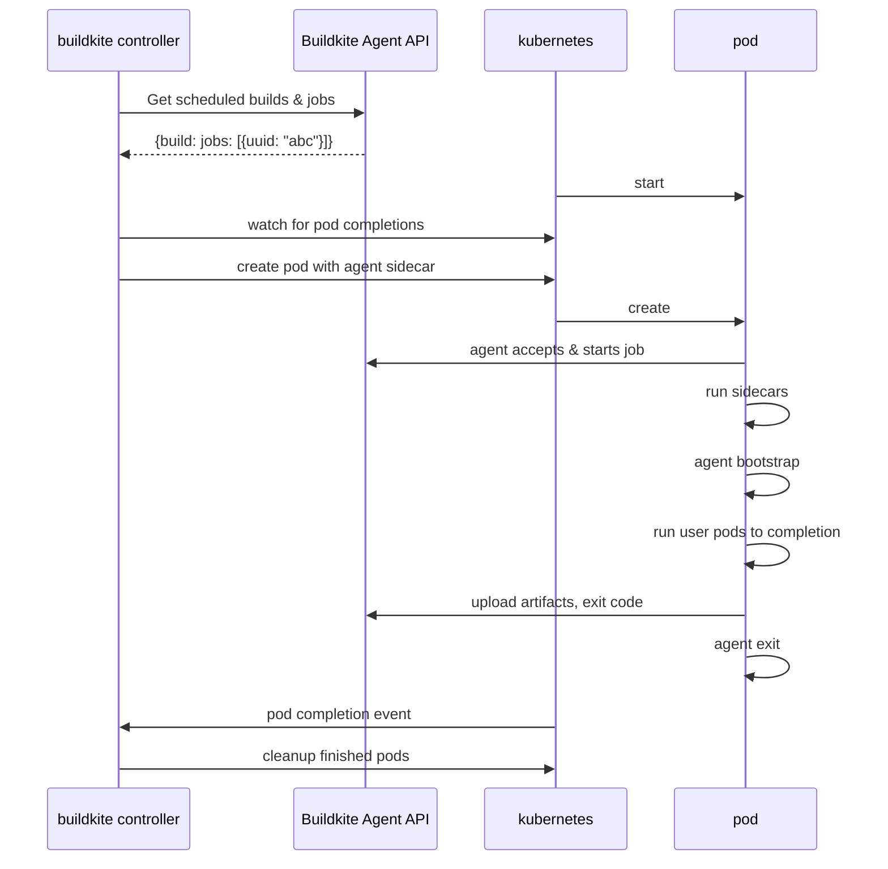

# Architecture

When a matching job is returned from the Agent API, the controller will create a Kubernetes Job containing a single Pod with containers that will acquire and run the Buildite job. The [PodSpec](https://kubernetes.io/docs/reference/kubernetes-api/workload-resources/pod-v1/#PodSpec) contained in the Job defines a [PodSpec](https://kubernetes.io/docs/reference/kubernetes-api/workload-resources/pod-v1/#PodSpec) containing all the containers required to acquire and run a Buildkite job:

- adding an init container to:
  - copy the agent binary onto the workspace volume (`copy-agent`)
  - check that other container images pull successfully before starting (`imagecheck`)
- adding a container to run the Buildkite agent (`agent`)
- adding a container to clone the source repository (`checkout`)
- modifying the (`container-N`) user-specified containers to:
  - overwrite the entrypoint to the agent binary
  - run with the working directory set to the workspace

The entry point rewriting and ordering logic is heavily inspired by [the approach used in Tekton](https://github.com/tektoncd/pipeline/blob/933e4f667c19eaf0a18a19557f434dbabe20d063/docs/developers/README.md#entrypoint-rewriting-and-step-ordering).

## Job processing diagram 



## The workspace volume

By default, the workspace directory (`/workspace`) is mounted as an `emptyDir` ephemeral volume. Other volumes may be more desirable (e.g. a volume claim backed by an NVMe device).
The default workspace volume can be set as stack configuration, e.g.

```yaml
# values.yaml
config:
  workspace-volume:
    name: workspace-2-the-reckoning
    ephemeral:
      volumeClaimTemplate:
        spec:
          accessModes: ["ReadWriteOnce"]
          storageClassName: my-special-storage-class
          resources:
            requests:
              storage: 1Gi
```
